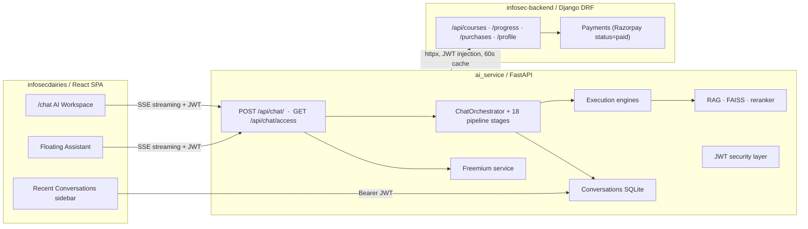
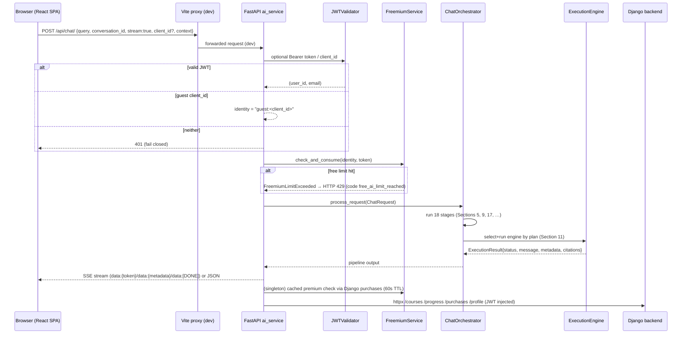
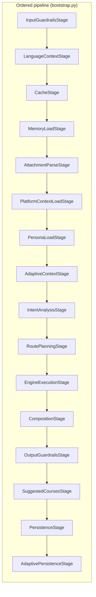
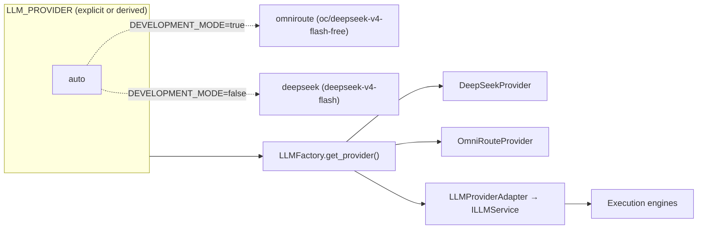
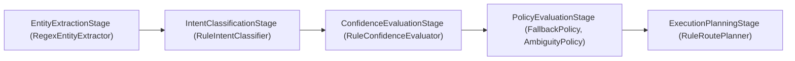
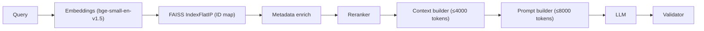

# BlueTeamers AI — Technical Documentation Context

| Header | Value |
|---|---|
| **PROJECT** | BlueTeamers AI Assistant — AI Workspace of the BlueTeamers cybersecurity e-learning platform |
| **DOCUMENT PURPOSE** | Authoritative implementation context for Claude to generate the final technical documentation. Analysis-only; nothing in this document was modified during extraction. |
| **SOURCE** | Local repository snapshot at `~/BlueTeamers-AI-Assistant` (branch `master`), extracted read-only. |
| **REPOSITORY LAYOUT** | `ai_service/` — FastAPI AI backend (~370 Python files); `infosecdairies/` — React + Vite SPA frontend |
| **STATUS** | Analysis complete. All 30 sections below. |

> Conventions used below: **IMPLEMENTED** = verified present & wired in the current code. **PARTIALLY IMPLEMENTED** = some parts wired, others stubbed/mock/future. **CONFIGURED** = covered by configuration/env with no committed code path or provider, or stub present. **NOT IMPLEMENTED** = absent from the current codebase. Anything not positively verified is labelled **"Not confirmed from the current codebase."**

---

## Table of Contents

1. Overview & Architecture at a Glance
2. Repository & Component Map
3. Technology Stack & Environment
4. High-Level System Architecture (flow diagrams)
5. Chat Processing Pipeline (ChatOrchestrator → Stages)
6. Prompt Construction & the System Prompt
7. Guardrails & Prompt-Injection Defences
8. LLM Provider Layer (Factory, Adapters, Providers)
9. Intent Intelligence Pipeline
10. Query Routing & Domain Classification
11. Execution Engines (RAG, General, Tool, Specialist, SOC, Platform)
12. Agent Orchestration (AgentExecutor + Schedulers)
13. RAG Pipeline (Retrieval, Rerank, Context)
14. Knowledge Base & Static Sources
15. Vector Store (FAISS) & Embeddings
16. Memory & Conversation History
17. Adaptive Learning Engine & Learner Signals
18. Persona & Learner-Level System
19. Multilingual & Indian-Language Support
20. Platform (Django) Integration Layer
21. Conversations, Favorites & Title Generation
22. Freemium Access Control & Monetisation
23. Security, Authentication & JWT
24. Rate Limiting & Abuse Controls
25. Middleware & Exception Handling
26. Observability, Logging, Metrics, Health
27. MCP / Tool-Calling Framework
28. Assessment Agent (in-chat quizzes)
29. Frontend AI Integration (Floating Assistant, Workspace, Sync)
30. Configuration, Environment & Deployment

---

## 1. Overview & Architecture at a Glance

BlueTeamers AI is a cybersecurity-mentor chatbot embedded into the BlueTeamers e-learning
platform. It is a **two-part system**:

- **`ai_service/`** — a self-contained FastAPI service that owns chat, RAG, intent/routing,
  personas, adaptive learning, multilingual responses, freemium enforcement and conversation
  history. It talks out to a Django backend for the user's live platform data (courses,
  progress, purchases).
- **`infosecdairies/`** — a React 18 SPA (Vite + Tailwind + shadcn/Radix + TanStack Query)
  that hosts the *Floating AI Assistant* (visible on almost every page) and a full
  `/chat` *AI Workspace* page.

The single architectural switch is **`DEVELOPMENT_MODE`** in `ai_service/.env`
(`app/core/config.py`):
`true` → local development (OmniRoute `/ oc/deepseek-v4-flash-free`, DEBUG logging, permissive
CORS); `false` → production (DeepSeek API, INFO logging, CORS must be explicit, RS256 JWT,
internal tokens required).



---

## 2. Repository & Component Map

```
~/BlueTeamers-AI-Assistant/
├── ai_service/                       # FastAPI AI backend
│   ├── app/
│   │   ├── main.py                   # App factory + router wiring
│   │   ├── lifecycle.py              # lifespan (startup/shutdown wiring)
│   │   ├── middleware.py             # MaxBodySize + CORS + Logging + Observability + Runtime
│   │   ├── exception_handlers.py     # global exception mapping
│   │   ├── core/                     # config.py (Settings), logging, middleware
│   │   ├── security/                 # auth.py (JWT), rate_limit.py
│   │   ├── api/                      # routes (chat, health, protected), dependencies.py
│   │   ├── chat/                     # ORCHESTRATOR + 18 pipeline stages + 16 engines + routing/intent
│   │   ├── rag/                      # RAGEngine orchestrator + exceptions + health
│   │   ├── retrieval/                # RetrievalService (query→embed→vector→meta→rerank)
│   │   ├── vector_store/             # FaissVectorStore (IndexFlatIP + IndexIDMap)
│   │   ├── embeddings/               # BAAI/bge-small-en-v1.5 (CPU) provider
│   │   ├── knowledge/                # static course knowledge ingestion + router
│   │   ├── memory/                   # short-term memory managers/stores
│   │   ├── conversations/            # SQLite conversation store + service + REST router
│   │   ├── multilingual/             # language modes, detection, preference store, router
│   │   ├── adaptive/                 # learner model engine + signals + SQLite store
│   │   ├── persona/                  # personas.py (mentor), levels.py (5 levels)
│   │   ├── freemium/                 # access control service + models + router deps
│   │   ├── platform/                 # DjangoPlatformRepository + PlatformApiClient + context
│   │   ├── llm/                      # factory + provider adapters
│   │   ├── prompt_builder/           # SimplePromptBuilder (system prompt)
│   │   ├── guardrails/               # Clean-Architecture guardrail engine
│   │   ├── mcp/                      # MCP client, providers, catalog, registry
│   │   ├── tools/                    # tool executors + cybersecurity implementations
│   │   ├── cache/                    # in-memory response cache
│   │   ├── agents/                   # executors/schedulers for plan-DAG execution
│   │   ├── planning/                 # capability resolver + route planner
│   │   ├── observability/            # metrics/tracing/logging/profiling + health
│   │   ├── streaming/                # streaming helpers + health
│   │   ├── chunking/ + indexing/     # doc pre-vectorization pipeline
│   │   └── models/                   # pydantic request/response models
│   ├── data/                         # runtime SQLite stores (memory.db, conversations.db, …)
│   ├── vector_store/                 # generated FAISS index + metadata
│   ├── logs/, scripts/, tests/
│   ├── .env                          # REAL secrets — gitignored, never commit
│   ├── .env.example                  # template mirrored in Section 30
│   ├── requirements.txt              # pinned (Section 3)
│   ├── Dockerfile                    # python:3.13-slim, uvicorn 1 worker
│   └── docker-compose.yml / start_ai_service.sh
│
└── infosecdairies/                   # React 18 SPA frontend
    └── src/
        ├── main.tsx                  # mounts <App/> (no router here)
        ├── App.tsx                   # ALL routes + provider stack (Section 29)
        ├── context/                  # AuthContext, AiAssistantContext, CurrencyContext
        ├── hooks/                    # useChat, useConversations, useAiAccess, usePageContext, …
        ├── pages/                    # ChatPage.tsx + +30 platform pages
        ├── components/ai/            # FloatingAssistant.tsx, UpgradeDialog.tsx
        ├── components/ui/chat/       # ChatInput, ChatMarkdown, LabCard, QuizCard, WorkspaceSidebar, …
        ├── components/ui/Chat.tsx    # full workspace chat surface
        ├── services/                 # api.ts, conversationsApi.ts
        ├── lib/                      # pageContext.ts, guestId.ts, logAnalysis.ts, labContext.ts
        └── data/                     # static courses.ts, lessons/, quizData.ts, liveCourses.ts
```

---

## 3. Technology Stack & Environment

### AI Service (`ai_service/`)
| Layer | Technology |
|---|---|
| Framework | FastAPI 0.141.1 + Uvicorn 0.52.1 (1 worker in Docker) |
| Validation | Pydantic 2.13.4 + pydantic-settings 2.14.2 |
| JWT | PyJWT 2.13.0 |
| HTTP client | httpx 0.28.1 |
| LLM frameworks | langchain 1.3.14, langgraph 1.2.10 (declared) |
| Vector search | FAISS (IndexFlatIP / IndexFlatL2 via IndexIDMap); numpy 2.5.1 |
| Embeddings | BAAI/bge-small-en-v1.5 (CPU) |
| Cache/queue | redis 8.1.0 (declared; app defaults to in-memory cache) |
| Observability | prometheus-client 0.26.0 |
| PDF/OCR/vision | pypdf 6.14.2, rapidocr-onnxruntime 1.2.3, opencv-python-headless 5.0.0.93 |
| Crypto | cryptography 50.0.0 |

> Note: `langchain`/`langgraph` are pinned but the chat flow is custom (no LangChain chains in
> the pipeline). Actual LLM calls go through the custom `app/llm` adapter layer.

### Frontend (`infosecdairies/`)
React 18, Vite, TypeScript, Tailwind CSS v3, shadcn/ui (Radix), `react-router-dom` v6,
TanStack Query, Recharts, React Hook Form + Zod, `@fontsource/jetbrains-mono` (from
`infosecdairies/CLAUDE.md`). Dev server on port 5173 (Vite default) with proxies listed in
Section 29. **No test runner is configured** (per `CLAUDE.md`: "There are no test files").

### Backend Django (referenced, not in this repo)
Django 6, DRF, dj-rest-auth, django-allauth, SimpleJWT (RS256 signed tokens consumed by the AI
service in production). All endpoints under `/api/`.

---

## 4. High-Level System Architecture



Non-streaming reply shape (`app/models/chat/chat_models.py:ChatResponse`):
`conversation_id`, `message`, `query`/`answer` (aliases), `metadata` (latency, citations,
trace_id, language*), `used_tools`.

---

## 5. Chat Processing Pipeline (ChatOrchestrator → Stages)

**Entry point:** `POST /api/chat/` (main, `app/api/routes/chat.py`) → `ChatService.process_request`
(`app/chat/service.py`) → `ChatOrchestrator.execute_pipeline` (`app/chat/orchestrator.py`).

The composition root in `app/chat/bootstrap.py:get_chat_service()` builds the ordered stage
list (18 stages). Each stage implements `IExecutionStage.execute(context) -> ExecutionContext`
(FastAPI 0.141.1 era, context is an immutable/copied `ExecutionContext`).



Order is authoritative from `ai_service/app/chat/bootstrap.py:291-325`:

1. **InputGuardrailsStage** — validates the raw user query first (injection heuristics, length
   cap) before any downstream stage touches it.
2. **LanguageContextStage** — resolves the response language *before* the cache key is built so
   every downstream stage sees the resolved code (Sprint 7).
3. **CacheStage** — in-memory response cache (DefaultCacheManager).
4. **MemoryLoadStage** — loads per-conversation history; *merges* into any existing
   `context.memory` rather than replacing it; scopes the window per `conversation_id`.
5. **AttachmentParseStage** — parses uploaded files/images so their content is injected into
   the query before routing/execution.
6. **PlatformContextLoadStage** — fetches the authenticated user's platform context (cached)
   and injects `memory["platform_context"]`; skipped when no token.
7. **PersonaLoadStage** — injects the BlueTeamers mentor persona + learner level.
8. **AdaptiveContextStage** — per-request teaching plan from the Adaptive Learning Engine.
9. **IntentAnalysisStage** — `IntentIntelligenceService.analyze_intent(query, convo_context)`.
10. **RoutePlanningStage** — the real routing brain.
11. **EngineExecutionStage** — instantiates an engine via the Factory using the plan; raises
    `RoutingError` if no engine selected.
12. **CompositionStage** — composes `ExecutionResult` output, citations, tool outputs.
13. **OutputGuardrailsStage** — validates the composed answer (length + leakage heuristics);
    short-circuits to a graceful refusal on violation.
14. **SuggestedCoursesStage** — appends course-recommendation cards when the plan requests them.
15. **PersistenceStage** — saves the turn to memory + conversations (deferred for streaming —
    see Section 5a).
16. **AdaptivePersistenceStage** — folds the turn into the learner model.

**`ChatOrchestrator.execute_pipeline`** honors `cancellation_requested` between stages and
extracts `execution_result` from metadata. If it is missing it fails with
`ExecutionResult.failed`. Streaming responses carry `generator` + `_pending_turn` in metadata.

### 5a. Streaming (`POST /api/chat/` with `stream:true`)
- The engine yields markdown chunks → `ChatService._stream_response` emits
  `data: {"token": "<chunk>"}` per chunk, a final `data: {"metadata": {...}}` (latency,
  citations, trace_id, language), then `data: [DONE]`.
- If an engine did not produce a generator, a **mock-stream fallback** tokenizes the final
  message (newline-preserving) so markdown structure is kept.
- `PersistenceStage` defers persistence to streaming completion: `_pending_turn` is persisted
  via `ChatService._persist_pending_turn` once the stream finishes, so history stores the real
  reply, never a `[Streaming Generator]` placeholder.
- Guest threads feed only the short-term memory window; they are excluded from authenticated
  Recent Conversations (`session_user` starting with `guest:`).

---

## 6. Prompt Construction & the System Prompt

`app/prompt_builder/simple_prompt_builder.py` builds the prompt for General + RAG + specialist
engines (separate from the RAG *service*-level PromptBuilderService). `build_prompt(query,
context) -> (prompt, system_prompt)`.

**System prompt block order** (docstring/`_SYSTEM_PROMPT`):
1. Base persona: "You are BlueTeamers AI … specialize in threat intelligence, MITRE ATT&CK,
   SOC analysis, incident response, security education."
2. Scope rules: answer ONLY cybersecurity/security-ops/BlueTeamers topics; decline off-topic
   (jokes, cooking, sports, trivia, non-security programming) politely.
3. **Ambiguous terms rule**: `siem/soc/ids/ips/firewall/honeypot` are ALWAYS cybersecurity;
   never list non-security meanings; never ask "which context?".
4. Platform-data rule: account/courses/progress/certificates answered ONLY from
   `[User Platform Context]`/`[Platform Data]`; never invent enrollments or external courses.
5. `[Context]` documents must be used, not fabricated.
6. `[Persona]` block overrides generic framing.
7. Greeting system prompt (`_GREETING_SYSTEM_PROMPT`) used when `_is_greeting(query)` —
   dedicated mentor-style SOC-shift opening (2–4 sentences), rejects plain "Hello! How can I
   help you?".
8. **`RESPONSE_STYLE_BLOCK`** — concise answers, progressive disclosure, valid Markdown,
   and "NEVER include internal tags, source identifiers, debug tags, agent names,
   latency/token/processing metadata".
9. `mode = detect_mode(query)` — summary/ELI5 mode adjustments (ELI5 wins over summary).
10. Adaptive teaching block (from AdaptiveContextStage) — level-aware guidance.
11. `[Session Memory]` block — conversation summary (last 6 lines), key facts, active
    investigation, uploaded file names.
12. `[Learner Level]` + persona block (appended by PersonaLoadStage).
13. `[User Platform Context]` (from PlatformContextLoadStage).

Output is additionally sanitised by `app/chat/sanitize.py:clean_response` (see Section 7).

---

## 7. Guardrails & Prompt-Injection Defences

Two complementary layers:

### (a) `app/guardrails` — Enterprise Guardrails Module (Clean Architecture)
- **Core concepts** (from `app/guardrails/README.md`): `GuardrailContext` (std payload +
  trace_id/request_id) → **Policies** (`IGuardrailPolicy`; e.g. `LengthValidationPolicy`,
  `InjectionDetectionPolicy`) returning `GuardrailResult (ALLOW|BLOCK|WARN)` →
  **Groups** (`ValidationGroup`, `SecurityGroup`, `ComplianceGroup`, priority-ordered) →
  **Pipelines** `InputPipeline`/`OutputPipeline` (parallel policy execution, fail-fast on
  BLOCK) → `GuardrailsService`.
- **Middleware**: `GuardrailsMiddleware` intercepts `/api/v1/chat`, `/api/v1/rag`, extracts the
  prompt, runs `validate_input()`; validates the JSON response before sending.
- **Streaming caveat (important)**: the README explicitly states the middleware supports
  request/response HTTP only — **streaming endpoints (e.g. `/stream`) natively bypass this
  middleware**. The main `/api/chat/` router does NOT use `GuardrailsMiddleware`; instead both
  input and output guardrails are applied **inside the pipeline** as `InputGuardrailsStage` and
  `OutputGuardrailsStage`, which therefore cover the streaming route.

### (b) In-pipeline guardrails (`app/chat/pipeline/guardrails_stage.py`)
`InputGuardrailsStage` (first) and `OutputGuardrailsStage` (after Composition) run a
`GuardrailsService` against the query/answer inside every request, including streaming.

### (c) Output sanitisation (`app/chat/sanitize.py`)
`clean_response()` strips, as a safety net, patterns the prompt already forbids:
- `[Document N]` prefixes and inline source markers
- `Source:` / `--- SOURCE: ...` lines and Sources/References headings/footers
- debug footers `agent:`, `latency:`, `trace-id:`, `tokens:`, `engine:` (≤60 chars value)
- deliberately does NOT touch markdown or answer content; collapses blank-line runs and trims.

---

## 8. LLM Provider Layer (Factory, Adapters, Providers)

`app/llm/factory.py` — `LLMFactory` singleton:
- `LLM_PROVIDER` ∈ `omniroute | deepseek | auto`; `auto` resolves from the
  deployment mode via `_apply_mode_defaults`: **dev → `omniroute`, production → `deepseek`**.
- Providers (imported lazily):
  - **DeepSeekProvider** — official DeepSeek OpenAI-compatible API (`DEEPSEEK_API_KEY`,
    `DEEPSEEK_BASE_URL`, `DEEPSEEK_MODEL=deepseek-v4-flash`); also a pinned OmniRoute model
    `oc/deepseek-v4-flash-free` as the local default.
  - OmniRoute provider exists for the local gateway (`OMNIROUTE_BASE_URL` defaults to
    `http://localhost:20128/v1`).
- Adapter: `LLMProviderAdapter` bridges `BaseLLMProvider -> ILLMService` used by engines.
- `LLM_MAX_TOKENS` optional hard cap on output tokens (all providers).
- Error model (`app/llm/exceptions.py`): `LLMException`, `ProviderConfigurationException`,
  `ProviderUnavailableException` — mapped to 500/503 statuses by the global handler
  (Section 25).



---

## 9. Intent Intelligence Pipeline

`app/chat/intent/` — `IntentIntelligenceService` wraps an `IntentOrchestrator` with 5 stages
(`bootstrap.py:_build_intent_service`):



- Deterministic, regex/rule-based; no LLM is called for intent classification.
- Output feeds the `IntentAnalysisStage`, whose `convo_context` includes memory + images +
  files. The produced `IntentType` feeds domain routing (Section 10).
- `IntentType` drives the `_AMBIGUOUS_INTENTS` mapping in `app/chat/routing/domains.py`.

---

## 10. Query Routing & Domain Classification

- **QueryRouter** (`app/chat/routing/query_router.py`): the deterministic entry point.
  `classify(query, intent_analysis) -> RoutingDecision` — **pure, no LLM**. It never generates
  responses and never calls the LLM directly; the process wraps it as a pipeline node.
- **RoutingDecision** (`app/chat/routing/decisions.py`): `query`, `intent`, `domain`,
  `domain_confidence`, `agent_id`, `agent_name`, `engine`, `llm_required`,
  `supports_recommendations`, `rationale`. Supporting models: `RouterRequest`,
  `RouterResponse`, `RoutingEventLogger`.
- **CyberDomain** (`app/chat/routing/domains.py`): enum
  `GENERAL, KNOWLEDGE, LEARNING, THREAT_INTEL, INVESTIGATION, PLATFORM, LAB, ASSESSMENT,
  TOOLING` plus Sprint-3 specialist domains
  (`WAZUH_LAB, PRACTICE_LAB, INVESTIGATION_GUIDANCE, WINDOWS_EVENT_LOG, LINUX_LOG,
  IOC_ANALYSIS, MITRE_GUIDANCE, DETECTION_RULE`).
- `_AMBIGUOUS_INTENTS` maps `IntentType -> domain`; the classifier combines the
  `IntentIntelligenceService` result + a domain lexicon.
- **RoutePlanningStage** selects the engine name; **EngineExecutionStage** creates it.

Routing map → engine (engines detailed in Section 11):
`GENERAL/GREETING → GeneralExecutionEngine`, `RAG_QUERY → RagExecutionEngine`,
`TOOL_REQUEST → ToolExecutionEngine`, others → `AgentExecutor` (walks a plan DAG), plus
specialist/SOC/PLATFORM engines for the Sprint-3/4/5 domains.

---

## 11. Execution Engines

`app/chat/engines/` — registry + factory + implementations.

**Registry** (`registry.py`): engines self-register at boot by uppercase name;
`ExecutionEngineFactory` instantiates them transiently per request and wraps each in a
`RuntimePolicyProxy` (resilient/exponential-backoff policy).

Registered engines (`bootstrap.py:213-240`) with construction wiring (specialist engines get
`retriever + llm + prompt_builder + optional platform_repo`; threat-intel gets `_threat_intel_tools()`):

| Registered name | Class | Purpose |
|---|---|---|
| `GENERAL` | `GeneralExecutionEngine` | conversational / general security chat (LLM + prompt builder) |
| `RAG` | `RagExecutionEngine` | context-augmented answers (retriever + LLM + platform repo) |
| `TOOL` | `ToolExecutionEngine` | tool-calling (ToolProviderResolver) |
| `AGENT` | `AgentExecutor` | walks a plan DAG of capabilities (Section 12) |
| `NOTES` | `NotesGenerationEngine` | in-chat notes generation (Sprint 3) |
| `SUMMARY` | `TopicSummaryEngine` | topic summarisation |
| `THREAT_INTEL` | `ThreatIntelExecutionEngine` | threat-intel domain, with external tools |
| `WAZUH_LAB` | `WazuhLabEngine` | Wazuh rule/lab assistance |
| `PRACTICE_LAB` | `PracticeLabEngine` | hands-on practice lab guidance |
| `INVESTIGATION` | `InvestigationExecutionEngine` | investigation workflows |
| `INVESTIGATION_GUIDANCE` | `InvestigationGuidanceEngine` | guided investigation |
| `WINDOWS_EVENT_LOG` | `WindowsEventLogEngine` | Windows event-log analysis |
| `LINUX_LOG` | `LinuxLogEngine` | Linux/syslog analysis |
| `IOC_ANALYSIS` | `IocAnalysisEngine` | IOC analysis |
| `MITRE_GUIDANCE` | `MitreGuidanceEngine` | MITRE ATT&CK guidance |
| `DETECTION_RULE` | `DetectionRuleEngine` | Sigma/YARA/detection rule help |
| `PLATFORM` | `PlatformExecutionEngine` | platform data-tooling answers (repo + context + recs + retriever + LLM) |

Every engine returns a standard **`ExecutionResult`**
(`app/models/chat/chat_models.py:ExecutionResult`):
`status (SUCCESS|DEGRADED|FAILED|BLOCKED)`, `engine_name`, `message`, `metadata`, `citations`,
`tool_outputs`, `documents`, `reasoning_metadata`, `latency_ms`, `cost`, `token_usage`,
`errors`, `stream`.

---

## 12. Agent Orchestration (AgentExecutor + Schedulers)

`app/agents/` + `app/planning/`:
- `app/agents/executors/agent_executor.py` — `AgentExecutor` registered as the `AGENT` engine.
  Executes a **plan DAG**: capability resolution then sequential scheduling.
- `app/planning/resolvers/engine_resolver.py` — `CapabilityEngineResolver` maps capabilities to
  engines.
- `app/agents/schedulers/sequential_scheduler.py` — `SequentialScheduler` runs plan steps in
  order.
- Constructed as `AgentExecutor(factory, CapabilityEngineResolver(), SequentialScheduler())`
  in `bootstrap.py` — the AGENT engine can therefore delegate to other engines.
- Wrapped by `RuntimePolicyProxy` alongside all engines.

---

## 13. RAG Pipeline

### Orchestrator
`app/rag/engine.py` — `RAGEngine`: retrieval → context → prompt → LLM → validator; publishes
`_llm_labels` for Prometheus-style metrics. Domain exceptions (`app/rag/exceptions.py`):
`RetrievalFailure`, `ContextFailure`, `PromptFailure`, `GenerationFailure`,
`EmptyContextException`, `OrchestrationFailure` (all subclass `BaseRAGException`).

### Retrieval service
`app/retrieval/service.py` — `RetrievalService(BaseRetriever)` pipeline:
**Query → Embeddings → Vector Store → Metadata → Reranker**.
- `default_top_k = settings.DEFAULT_TOP_K` (5), `max_top_k = MAX_TOP_K` (20),
  `min_similarity_score = MIN_SIMILARITY_SCORE` (0.4 in `config.py`).
- `BaseReranker` applied after vector search (`get_reranker()`).

### Flow


---

## 14. Knowledge Base & Static Sources

`app/knowledge/`:
- **Sources** (`sources.py`): a static-content loader over **`course_catalog.json` + all_lessons.json**
  only. It explicitly excludes dynamic platform data (that is served live via Django
  "Platform Repository").
  - `_SLUG_DISPLAY_IDS`: canonical slug → frontend display id mapping
    (e.g. `blue-team-soc-fundamentals → soc-fundamentals`).
  - `content_hash()` → SHA-1 for incremental indexing.
  - `_SOURCE_LESSON_JSON = "lesson_content"`, `_SOURCE_COURSE_META = "course_metadata"`.
- **Ingestion pipeline** (`pipeline.py`): `KnowledgeIngestionPipeline` ingests to the vector
  DB batched (`KNOWLEDGE_BATCH_SIZE=32`), gated by `KNOWLEDGE_INGEST_ON_STARTUP=true`.
- **REST admin endpoints** (`router.py`, prefix `/api/knowledge`, gated by
  `require_internal_token`):
  - `GET /api/knowledge/status` — vector count, loaded flag, lesson/course counts, source files.
  - `POST /api/knowledge/ingest` — triggers ingestion.

---

## 15. Vector Store (FAISS) & Embeddings

- **Embeddings** (`app/embeddings/`): provider loads `EMBEDDING_MODEL = BAAI/bge-small-en-v1.5`
  on `EMBEDDING_DEVICE = cpu`, batch 32, `EMBEDDING_NORMALIZE = true`.
- **Vector store** (`app/vector_store/provider.py`): `FaissVectorStore`:
  - `IndexFlatIP` (inner product on normalised embeddings) wrapped in `IndexIDMap` with an
    **int64 ID map** for string chunk IDs; L2 fallback (`IndexFlatL2`).
  - `VECTOR_INDEX_TYPE`, `VECTOR_PATH = ./vector_store/index.faiss`,
    `VECTOR_METADATA_FILE = ./vector_store/metadata.json`.
  - `threading.Lock` guarded; raises `VectorStoreException` if `faiss` is not installed.
- Chunking (`app/chunking/`): `CHUNK_SIZE=600`, `CHUNK_OVERLAP=120`,
  `MAX_DOCUMENT_SIZE_MB=5`. Indexing (`app/indexing/`): `INDEX_BATCH_SIZE=10`,
  `MAX_CONCURRENT_DOCUMENTS=5`, `RETRY_COUNT=3`.

---

## 16. Memory & Conversation History

- `app/memory/` — short-term conversation memory:
  - `InMemoryStore` (dict-backed, `asyncio.Lock`) — documented as "production-ready for
    single-instance; should be replaced by RedisStore in a distributed environment".
  - `DefaultMemoryManager`, `MemoryService`, `get_memory_service/store` DI.
  - `MEMORY_ENABLED=true`, `MEMORY_WINDOW=10`, `MAX_SESSION_MESSAGES=50`,
    `MEMORY_DB_PATH=data/memory.db` (SQLite; async worker thread for blocking calls).
- `MemoryLoadStage` merges history into `context.memory` per `conversation_id`; scoped by
  `_memory_session_user` so the window is per conversation.
- `PersistenceStage` saves turns; streaming defers via `_pending_turn` (Section 5a).
- Adaptive `SessionMemoryManager` (Section 17) produces conversation summaries/facts used by
  the prompt builder's `[Session Memory]` block.

---

## 17. Adaptive Learning Engine & Learner Signals

`app/adaptive/`:

- **Engine** (`engine.py`, `AdaptiveLearningEngine`):
  - `DEFAULT_BASE_LEVEL = "intermediate"`; `LEVEL_TO_DEPTH` (beginner 2 → professional 5);
    `_DEPTH_TERMINOLOGY`, `_DEPTH_STYLE` (analogy-first → dense professional).
  - `MIN_CONFIDENCE 0.05`, `MAX_CONFIDENCE 0.98`, `MAX_DELTA_PER_OBSERVATION 0.08`.
  - `_score_to_level` thresholds at 0.4 / 0.6 / 0.8.
  - **Base level is derived, never stored as an identity**; temporary overrides
    (beginner/expert) shape only the current request.
- **Signals** (`signals.py`, `extract_signals`): keyword-driven.
  - `_BEGINNER_OVERRIDE` / `_EXPERT_OVERRIDE` phrase lists.
  - `_BEGINNER_VOCAB` / `_EXPERT_VOCAB` (ttps, sigma, yara, kql, spl, beaconing, …).
  - `_PRACTICAL` terms (example, hands-on, lab, …).
- **Store**: `SQLiteLearnerStore` (`data/memory.db`).
- **Service**: `AdaptiveLearningService(engine, SessionMemoryManager, store)` — used by
  `AdaptiveContextStage` (teaching plan) and `AdaptivePersistenceStage` (post-turn update).
- `SessionMemoryManager` stores conversation summaries/key facts/investigations used in prompts.

---

## 18. Persona & Learner-Level System

`app/persona/`:
- **Personas** (`personas.py`): `Persona` frozen dataclass — `name`, `display_name`,
  `identity`, `expertise`, `style`, `response_format`, `domain_priority`, `personality`.
  - `CYBERSECURITY_EXPERTISE` — 26 items: Blue Team Ops, SOC, Threat Hunting, Threat Intel, IR,
    SIEM, Windows/Linux/Cloud/Network Security, Malware Analysis, DFIR, MITRE ATT&CK, OWASP,
    Detection Engineering, Sigma, YARA, Log Analysis, Phishing, AD, Identity, Ransomware, IOC,
    CVE, Vuln Mgmt, SOC Workflows.
  - `CYBERSECURITY_MENTOR_PERSONA` — `name = "cybersecurity_mentor"`, identity
    "You are BlueTeamers …"; persona-aware greeting and off-topic templates.
- **Levels** (`levels.py`): `LearnerLevel` enum `BEGINNER, INTERMEDIATE, ADVANCED,
  PROFESSIONAL, INSTRUCTOR`; `LevelProfile(label, teaching_guidance)`; `LEVEL_PROFILES` with
  explicit teaching-guidance strings per level.
- The `PersonaLoadStage` injects the persona block and `[Learner Level]`; the prompt builder
  appends both ahead of `RESPONSE_STYLE_BLOCK`.

---

## 19. Multilingual & Indian-Language Support

`app/multilingual/` (Sprint 7):
- **Catalog** (`languages.py`): `LanguageMode` enum — `AUTO`, `ENGLISH` + **12 Indian
  languages** (`hi, te, ta, kn, ml, bn, mr, gu, pa, or, ur, as`) and bilingual code-mixed
  modes `te+en` (Telugu-English "Tinglish"), `hi+en`, `ta+en`, `kn+en`, `ml+en`, `bn+en`,
  `mr+en`, `gu+en`, `pa+en`, `or+en`, `ur+en`. Bilingual metadata per mode (`LANGUAGE_META`).
- **Stage** (`stage.py`): resolution order —
  explicit `language` request param → stored preference → auto-detect; persists the resolved
  preference; writes `language` / `language_label` / `language_block` into `context.memory`
  and `context.metadata` (used to surface the language in API metadata).
- **REST preference API** (`router.py`, prefix `/api/language`, Bearer-JWT required):
  - `GET /api/language/preference` — stored mode (default `auto`).
  - `PUT /api/language/preference {language}` — persist (`422` for unsupported codes;
    `"auto"` clears the preference).
  - `DELETE /api/language/preference` — reset to auto.
- Guests are handled client-side (localStorage), so no guest endpoint is needed.

---

## 20. Platform (Django) Integration Layer

`app/platform/`:
- **Repository** (`repositories/django_repository.py`, `DjangoPlatformRepository`): maps
  HTTP/domain failures to typed exceptions (`PlatformAuthenticationFailed`, …). Reads
  `/courses`, `/progress`, `/purchases`, `/profile`. `_static_lesson_counts()` reads
  `./app/knowledge/data/course_catalog.json` for fallback lesson counts.
- **Client** (`services/platform_client.py`, `PlatformApiClient`):
  - `httpx.AsyncClient`, base `settings.DJANGO_API_URL`, `Limits(max_keepalive=20, max=100)`,
    timeouts connect 5s / read 30s / write 10s.
  - TTL cache 60s; retries; **JWT injection** (forwards the caller's Bearer token).
- **`UserContextBuilder`** (`platform/context/user_context.py`) — assembles `platform_context`
  string injected by `PlatformContextLoadStage` into `memory["platform_context"]`.
- **`RecommendationService`** — recommends courses ("next activity").
  Used by `SessionInitializer` and `PlatformExecutionEngine`/`SuggestedCoursesStage`.
- `PlatformExecutionEngine` — the `PLATFORM` engine (repo + context builder + recommendation
  service + retriever + LLM + prompt builder).

### Session initializer
`app/chat/services/session_initializer.py` — `SessionInitializer` concurrently fetches
profile + purchases + courses (+ per-course progress) and builds a `SessionInitializationResponse`
(`welcome_message` via LLM + `platform_context` payload). **Not confirmed from the current
codebase:** no FastAPI route in the router set (Section 23/25) was found to expose
`GET /api/chat/session` (the frontend calls this path — see Section 29), and
`SessionInitializer` is not imported by `main.py`/`bootstrap.py`. The class exists but its
wiring is **not confirmed**.

---

## 21. Conversations, Favorites & Title Generation

`app/conversations/` (Sprint 6):
- **Store** (`store.py`, `SQLiteConversationStore(db_path="data/conversations.db")`):
  - `sqlite3`, `check_same_thread=False`, blocking calls routed through a worker thread.
  - Table `conversations`: `conversation_id TEXT PK`, `user_id NOT NULL`, `title NOT NULL`,
    `created_at`, `updated_at`, plus message metadata columns.
  - **Every query scoped by `user_id`**; pagination via `OFFSET/LIMIT`.
- **Service** (`service.py`, `ConversationService`): create/list/search/open/update/delete,
  favorite/pin/rename/archive, paginated listing, `ConversationEventPublisher` lifecycle
  events. `max_title_len=60`, `default_page_size=20`.
- **Title generation** (`title.py`): deterministic, **no LLM**.
  - `generate_title(first_message, course_title, max_len)` — strips lead words/greetings,
    checks course keywords (`_COURSE_KEYWORDS`, e.g. "Understanding RAG & Vector Databases"),
    Sprint-4 smart titles (`_SMART_TITLES` e.g. "Windows Event Log Analysis", "IOC Analysis",
    "Splunk Investigation"), else `_title_case(_slugify_topic(…))` ("About …" for short
    topics). Max 60 chars, ellipsis clipped.
  - `is_greeting_message()` — greeting-only threads keep the "New Chat" placeholder title.
  - `is_placeholder_title()`, `is_greeting_title()` for re-titling when a meaningful question
    arrives.
- **REST API** (`router.py`, prefix `/api/conversations`, Bearer-JWT, user-scoped via the
  stable `user_id` claim):
  - `GET /api/conversations?filter=&search=&days=&page=&page_size=` (list)
  - `GET /api/conversations/search?q=` (search title/messages/course/tags)
  - `POST /api/conversations` (create, 201)
  - `GET /api/conversations/{id}` (resume full history)
  - `PATCH /api/conversations/{id}` (rename/favorite/pin/archive/course…)
  - `DELETE /api/conversations/{id}` (204; deletes messages too)
  - `POST /api/conversations/{id}/favorite` / `…/unfavorite`

---

## 22. Freemium Access Control & Monetisation

`app/freemium/` (Sprint 5):
- **Service** (`service.py`, `FreemiumService`):
  - `FREEMIUM_ENABLED=true` (default), `FREEMIUM_FREE_MESSAGE_LIMIT=5` (per reset interval),
    `FREEMIUM_RESET_POLICY="daily"` (UTC day reset) / `"never"`,
    `FREEMIUM_PREMIUM_PURCHASE_STATUSES="paid"`.
  - Premium check via `IPlatformRepository` (Django purchases) cached in-process
    `_PREMIUM_CACHE_TTL_SECONDS = 60`.
  - Raises `FreemiumLimitExceeded` (models: `AccessDecision`, `AccessLevel`, `AccessStatus`,
    `UsageState`). `FREEMIUM_PREMIUM_CHAT_GATE=true` gates the `/chat` workspace.
- **Consumption path:** `_resolve_identity` returns `(tracking_identity, token)`:
  - valid JWT → `(user_id, token)` (premium applies),
  - no/garbage token + `client_id` → `("guest:<client_id>", None)` (always free, still limited),
  - neither → `HTTPException 401` (**fail closed**; never grants unlimited to untrackable
    callers).
- **429 upgrade payload** (`_limit_exceeded_detail`): guest → "Login and join a BlueTeamers
  course…"; signed-in free → "Purchase any BlueTeamers course…"; body
  `{message, code: "free_ai_limit_reached", access: <status.to_dict()>}`.
- **Endpoints:**
  - `GET /api/chat/access?client_id=` → `AccessStatus` (daily "X / Y AI messages remaining",
    `is_premium`); frontend uses it for the usage indicator and the workspace gate.
  - Both chat POST routes call `check_and_consume(identity, token, client_id)`.
- Guest allowance carry-over on login: the frontend hits `/api/chat/access?client_id=<guest>`
  with the new JWT so the merged identity never gets a fresh daily quota
  (`services/api.ts:carryOverGuestAiAllowance`, best-effort).

---

## 23. Security, Authentication & JWT

`app/security/auth.py` + `app/api/dependencies.py`:

- **`JWTValidator`** (`security/auth.py`):
  - `_load_public_key()` reads `settings.JWT_PUBLIC_KEY_PATH`.
  - **Production fails closed RS256-only** when the public-key path is set/readable; earlier
    recent commit hardened PyJWT `aud`/`iss` handling (without an explicit `audience` PyJWT
    raises `InvalidAudienceError`). Development falls back to HS256 `JWT_SECRET`.
  - `resolve_user_identity(token) -> (user_id, email)` — token **must** carry `user_id` (int)
    and `email` claims; identity keyed by the stable `user_id` (never email — survives token
    refresh).
  - **Ambiguity for the reader:** `_load_public_key` triggers production startup refusal
    without a readable key; the exact distinction between "no key → HS256 fallback" vs
    "failure → refuse startup" is implementation-detail-sensitive — treat the fail-closed
    production behavior as authoritative (per the recent commit intent).
- **Dependencies** (`api/dependencies.py`):
  - `get_current_user` — required `HTTPBearer`; returns typed `AuthenticatedUser` (401 +
    `WWW-Authenticate: Bearer`).
  - `get_optional_raw_token` — optional bearer extraction (token or None), used by chat.
  - `get_raw_token` — raw JWT string for downstream Django forwards.
  - **`require_internal_token`** — gates `/api/knowledge/*` + `/debug/*`: matches
    `X-Internal-Token` header (or Bearer) using `secrets.compare_digest` against
    `INTERNAL_ADMIN_TOKEN`. Dev short-circuits when unset; **production has no bypass and is
    REQUIRED for those routes to be usable**.
- Identity policy recap (fail closed): chat endpoints (both `/api/chat/` and legacy
  `/api/v1/chat/*`) reject 401 a caller with neither a valid JWT nor a `client_id`.
- Passwords/tokens are never logged; `RequestValidationError` handler strips `input`/`ctx`
  from 422 responses so rejected bodies carrying secrets are never echoed (Section 25).

---

## 24. Rate Limiting & Abuse Controls

`app/security/rate_limit.py`:
- `FixedWindowLimiter` — in-process fixed-window counter keyed by identity; `_MAX_WINDOWS`
  ~100k entries with LRU-style eviction; `reset`/`clear` helpers.
- `enforce_chat_rate_limit(request)` FastAPI dependency (used by all chat endpoints):
  - skipped when `CHAT_RATE_LIMIT_ENABLED=false`;
  - key = `user:<user_id>` when a valid Bearer token is present (resolved via
    `resolve_user_identity`), else `ip:<request.client.host>` — **the IP is the transport
    peer, never `X-Forwarded-For`, so spoofed headers cannot reset the limit** (proxy note:
    configure `--forwarded-allow-ips` behind a trusted proxy);
  - over limit → `429` with `Retry-After`.
- Config: `CHAT_RATE_LIMIT=60`, `CHAT_RATE_WINDOW_SECONDS=60`. Documented as suitable for
  single-instance; swap for Redis when scaling horizontally.
- Freemium layer (Section 22) is the message-count gate; rate limiting is the request-count
  gate. Body-size guard: `MaxBodySizeMiddleware` 2 MiB → `413` (Section 25).
- Pydantic caps: `ChatRequest` limits attachments to **5** (images & files each `max_length=5`,
  validator), legacy `ChatRequest.query ≤ 2000` chars.

---

## 25. Middleware & Exception Handling

### Middleware (registration order, outermost first — `app/middleware.py`)
1. **`MaxBodySizeMiddleware`** — 2 MiB hard cap:
   - Content-Length check first (413 without buffering);
   - `_SKIP_BODY_READ = {"/api/chat/", "/api/v1/chat/stream", "/api/v1/chat"}` — body-reading
     is skipped for those exact streaming paths because Starlette's BaseHTTPMiddleware raises
     `Unexpected message received: http.request` when a body-reading middleware wraps a
     `StreamingResponse`; the Content-Length header check still applies for those routes;
   - other POST/PUT/PATCH read + discard the body, reject oversize with 413, and rebuild the
     request stream (`request._receive`) so downstream can still read.
2. **CORS** — `allow_origins=settings.CORS_ORIGINS`, credentials, `*` methods/headers.
   Production forbids `*`/empty with credentials (`config._apply_mode_defaults` raise).
3. **LoggingMiddleware** (`core/middleware`) — request id, timing, structured logs.
4. **ObservabilityMiddleware** — tracing & metrics (Section 26).
5. **RuntimeMiddleware** — runtime manager wiring.

DNS/FastAPI ordering note: body middleware is registered first (outermost), Observability
last (outermost for timing).

### Exception handlers (`app/exception_handlers.py`)
| Exception | Status | Body |
|---|---|---|
| `StarletteHTTPException` | passthrough | `{detail}` (logged) |
| `RequestValidationError` | 422 | errors with `input`/`ctx` **stripped** (anti-secret-leak) |
| `BaseRAGException` (unhandled) | 500 | `{"detail": "Internal domain fault occurred."}` |
| `MemoryException` | 500 | `{"detail": "Internal memory fault occurred."}` |
| `LLMException` / `ProviderConfigurationException` | 500 | `{code: "provider_configuration"}` (raw msg never returned) |
| `LLMException` (unavailable) | 503 | `{code: "provider_unavailable"}` |
| generic `Exception` | 500 | `{"detail": "Internal server error"}` (unhandled logged) |

### Chat-specific mapper (`app/chat/exceptions/handlers.py`)
`handle_chat_exception` converts domain errors → HTTPException without leaking internals
(`EmptyContextException`→404, `ValidationFailure`→500, `RetrievalFailure`→500,
`GenerationFailure`→502, other `BaseRAGException`→500, else 500). Typed chat errors
(`chat/exceptions/chat_exceptions.py`): `ValidationError`, `AuthorizationError`,
`RoutingError`, `EngineUnavailable`, `ProviderFailure`, `TimeoutError`, `RateLimitError`,
`ToolExecutionError`, `RAGFailure`, `StreamingFailure`, `UnknownFailure` — each with a
`code` (`ERR_*_<status>`) and optional `trace_id`.

---

## 26. Observability, Logging, Metrics, Health

`app/observability/` + `app/core/logging.py` + `app/health`:
- **Metrics**: `prometheus-client`, endpoint `METRICS_ENDPOINT="/metrics"` (`obs_router`);
  `METRICS_PROVIDER=prometheus`. RAG publishes `_llm_labels`-keyed counters.
- **Tracing**: `TRACING_PROVIDER=native`, `TRACING_ENABLED`, request-id via
  `request_id_var` (ContextVar) so every log line/scatter carries the trace.
- **Logging**: `LoggingMiddleware`; structured; `LOG_LEVEL` derived per mode
  (dev DEBUG / prod INFO); `RequestValidationError`/HTTP/unhandled log helpers.
- **Profiling/diagnostics/adapter/metrics directories** under `observability/` (implemented
  modules, not exhaustively enumerated wire-by-wire).
- **Health** (`app/health`, `api/routes/health.py`, `chat/health.py`, `rag/health.py`,
  `memory/health.py`, `streaming/health.py`, `cache/health.py`,
  `observability/service_health.py`):
  - `GET /api/health` — aggregated health across chat/rag/memory/streaming/cache/obs/guardrails
    (the Docker HEALTHCHECK hits `http://localhost:8000/api/health`).
  - `GET /health` / `GET /` — basic health (app-level router).
  - `GET /api/debug/platform-health` — internal-token-gated Django/authentication/courses/
    labs/progress connectivity diagnostic.
- `ChatHealthService`, `RAGHealthService`, etc. each report fine-grained service health.

---

## 27. MCP / Tool-Calling Framework

`app/mcp/` + `app/tools/`:
- **MCP** (model-context-protocol) support is **CONFIGURED** — `MCP_ENABLED=true`, servers via
  inline JSON `MCP_SERVERS_CONFIG` or file `MCP_SERVERS_CONFIG_PATH`
  (e.g. repo-style `@modelcontextprotocol/server-filesystem` stdio example in `.env.example`).
  Modules: `client/` (`mcp_client.py`, sessions), `interfaces/`, `providers/legacy_provider.py`,
  `provider_registry/`, `catalog/tool_catalog.py`, `resolvers/tool_provider_resolver.py`,
  `registry/mcp_registry.py`, `config.py`.
- **Legacy tool provider**: `LegacyToolProvider(LocalToolExecutor(tool_service))` — bridges
  `app/tools/` executors into the MCP catalog. `ToolProviderResolver` resolves tools for the
  `TOOL` engine.
- **Tools** (`app/tools/implementations/cybersecurity/`): e.g. `IndicatorFetcherTool`,
  `MITRETool` (instanced in `bootstrap._threat_intel_tools()` as best-effort — failures logged
  and skipped so threat-intel still falls back to the LLM). `LocalToolExecutor` runs tools
  locally.
- The `TOOL` engine (`ToolExecutionEngine`) drives tool calls; tool outputs flow into
  `ExecutionResult.tool_outputs`.

---

## 28. Assessment Agent (in-chat quizzes)

- **Config** (`core/config.py`): `ENABLE_ASSESSMENT_AGENT=true`;
  `ASSESSMENT_MINIMUM_CONFIDENCE_THRESHOLD=0.6`; `ASSESSMENT_DEFAULT_QUIZ_LENGTH=5`;
  `ASSESSMENT_DEFAULT_DIFFICULTY=beginner`; `ASSESSMENT_MAXIMUM_QUESTIONS=10`;
  `ASSESSMENT_ALLOW_ADAPTIVE_DIFFICULTY=true`.
- **Course-aware**: `ASSESSMENT_REQUIRE_ENROLLMENT=true` (only offer a quiz when the user is
  enrolled in a matching course); `ASSESSMENT_RECENT_WINDOW_SECONDS=604800` (7 days cooldown);
  `ASSESSMENT_COURSE_RECOMMENDATION_COUNT=3` (fallback course recs).
- **Pipeline**: dedicated `assessment_stage.py` exists; frontend renders interactive
  `QuizCard`, `QuizOfferCard`, `QuizResultCard` from streamed metadata (Section 29). Because
  quiz interaction is metadata/stream-driven, the assessment domain lives partly on the
  backend (agent) and partly in the frontend widgets; the exact trigger contract between
  `assessment_stage.py` and the `QuizCard` metadata keys is **not exhaustively verified**.

---

## 29. Frontend AI Integration

### App shell (`src/App.tsx`, 101 lines)
Provider stack: `HelmetProvider → QueryClientProvider → TooltipProvider → (Toaster, Sonner,
CookieConsent) → AuthProvider → CurrencyProvider → BrowserRouter → AiAssistantProvider →
Routes`. Navbar/Footer are NOT global — each page renders its own.

Routes: `/`, `/about`, `/courses`, `/courses/:slug`, `/live-courses/:courseId`,
`/courses/:slug/lesson/:lessonId`, `/courses/:slug/quiz/:quizId`, `/courses/:slug/checkout`,
`/courses/:courseId/resources/:resourceId` (+ `/resource/`), `/labs` (+ `/alerts`,
`/incidents`, `/endpoints`, `/threat-intel`, `/email-security`, `/settings`, `/logs`),
`/dashboard`, `/auth`, `/forgot-password`, `/verify-email`, `/google/onboarding`,
`/auth/google-callback`, `/privacy`, `/terms`, `/disclaimer`, `/verify/:slug/:emailHash`
(+ redirect aliases), **`/chat`** (ChatPage), `*` → NotFound.

Auth storage: `localStorage` keys **`accessToken` / `refreshToken`** (+ `userEmail`,
`userFullName`); auto-refresh every 10 min (`AuthContext`).

### AiAssistantProvider (`context/AiAssistantContext.tsx`, 121 lines)
- Owns floating-window open/minimized state, page context, freemium access status, upgrade
  dialog. Chat logic itself is the shared **`useChat`** hook.
- **`HIDDEN_PATHS = new Set(["/chat", "/auth", "/login"])`** — floating assistant hidden
  there; window state resets on navigating to a hidden path.
- **Lazy-loads** `FloatingAssistant` via `React.lazy` (keeps initial bundle small).
- On `chatState.errorDetail?.code === "free_ai_limit_reached"` → opens `UpgradeDialog`.
- After each successful free send, re-fetches access status.

### useChat (`hooks/useChat.ts`, 885 lines)
- slot-less persistent conversation across surfaces and reloads:
  - `sessionStorage` keys: `bt_chat_messages_v1`, `bt_chat_conversation_id_v1`,
    `bt_chat_language_v1`.
  - **BroadcastChannel `bt_chat_sync_v1`** cross-tab sync: `request`/`state`/`clear` message
    types; request-pull on fresh tab; echo-suppression via last-published hash; explicit
    CLEAR-only wipe rule (a stray empty snapshot never clobbers a live conversation).
  - `conversationId` persists so returning via Browser Back resumes the same thread.
- **`streamChat`** — POSTs `/api/chat/` (Bearer header when token exists; `client_id` =
  `getGuestId()` when anonymous); parses SSE manually (line-buffered, handles split
  metadata events): `data: {token}` appended to last message, `data:{metadata}` merged,
  `data:[DONE]` stops; non-OK responses surfaced as structured `ChatError` (status, code,
  access).
- **sendMessage(text, attachments?, overrideConversationId?, labContext?, pageContext?)**:
  splits attachments into `images[]` (data URLs) and `files[]`; payload
  `{query, stream:true, conversation_id, images?, files?, context:{lab?, page?}, language?,
  client_id?}`.
- **Language**: initialised `auto` from `bt_chat_language_v1`; pulls the authenticated user's
  server preference from `/api/language/preference` once; `setLanguage` persists to local +
  server **only** after an explicit user toggle (`languageToggledRef`) so a remembered
  preference is never re-sent as a hard override (which would break Tinglish auto-detection).
- **LabCard integration**: `patchActiveLabCard` (updates the LabCard owning the active lab),
  `absorbLabHint` (drops trailing user+hint bubbles and folds the hint into the lab card),
  `sendLabHint` (silent `query:'hint'` call that never creates chat messages).
- **Session init**: `initializeSession` fetches **`/api/chat/session`** for a personalized
  seeded greeting + platform context; falls back to `buildDefaultWelcome` (name-aware) if the
  fetch fails. **Note:** no `GET /api/chat/session` route was found among the registered
  routers (Sections 23/25) — the fallback path is what actually runs; **not confirmed from
  the current codebase** that the endpoint exists server-side. Recommended for the doc:
  describe both the intent and the graceful fallback.

### useConversations (`hooks/useConversations.ts`, 146 lines)
Sidebar state: paginated + filterable + searchable list; optimistic favorite/unfavorite/
rename/delete with silent refetch revert; `open` loads full history; `recent` filter passes
`days=7`; search debounced 300 ms.

### conversationsApi (`services/conversationsApi.ts`, 158 lines)
Bearer JWT attached from `localStorage.accessToken`; calls
`/api/conversations` (list/search/create/get/patch/delete + favorite/unfavorite) — matching
backend Section 21. Types: `ConversationSummary`, `Conversation`, `ConversationListPage`.

### Page context (`hooks/usePageContext.ts` + `lib/pageContext.ts`)
Detects current location (lesson/quiz/resource/course/lab/wazuh alert/dashboard/workspace…)
and sends a structured `context.page` payload so the backend can answer "about this page".
`lib/pageContext.ts` maps course slugs → data ids (`COURSE_SLUG_TO_DATA_ID`) and resolves
titles from static `data/courses.ts` + `data/lessons/`.

### FloatingAssistant (`components/ai/FloatingAssistant.tsx`, 622 lines)
- Launcher button (draggable, position persisted `bt-ai-launcher-pos`) + compact window
  (draggable, `bt-ai-window-pos`); minimized pill bar; status ember (green/amber/red by
  remaining free messages); ticket tray visualising the free limit; "Open in full workspace
  (new tab)" → `window.open("/chat", …)`.
- Guests always treated as free; fail-closed logic ensures an unknown access status never
  presents a guest as premium.
- Reuses the shared `useChat` state via `AiAssistantContext`; `syncFromSession()` re-reads
  sessionStorage on open (fresh tab pull + in-page continuity).

### Workspace page (`pages/ChatPage.tsx`, 162 lines)
- Shares the single chat state from `AiAssistantContext` (same conversation as the floating
  window, live mid-stream). Renders `Navbar + Chat + WorkspaceSidebar`.
- **Gate**: `gated = !authPending && isGuest && access?.is_premium !== true` — logged-in users
  (even without purchase) may open the workspace (backend still enforces limits); guests are
  gated out unless positively premium. `useConversations` refreshes when a new conversation
  finishes loading.

### Dev proxies (`infosecdairies/vite.config.ts`)
`/api/chat`, `/api/conversations`, `/api/health` → **`http://127.0.0.1:8001`** (FastAPI);
everything else under `/api` → **`http://127.0.0.1:8000`** (Django). `VITE_API_BASE_URL`
defaults to relative so Vite proxy (dev) / Vercel rewrites (prod) handle routing
(`services/api.ts`).

---

## 30. Configuration, Environment & Deployment

### Mandatory env (`ai_service/.env`; template mirrors `.env.example`)
| Var | Required? | Notes |
|---|---|---|
| `SECRET_KEY` | **Yes** (no default) | fails startup if absent |
| `JWT_SECRET` | **Yes** (no default) | |
| `DJANGO_API_URL` | **Yes** (no default) | base of Django `/api` |
| `DEVELOPMENT_MODE` | default `true` | THE single switch |
| `JWT_PUBLIC_KEY_PATH` | prod | RS256 public key; empty → legacy HS256 fallback (dev) |
| `INTERNAL_ADMIN_TOKEN` | **prod required** | gates `/api/knowledge/*`, `/debug/*` |
| `REDIS_URL` | optional | app defaults to memory cache |
| `CORS_ORIGINS` | **prod required** | explicit origins; wildcard forbidden in prod |

### LLM
`LLM_PROVIDER` (auto: dev→omniroute, prod→deepseek | explicit: `omniroute |
deepseek | auto`); `OMNIROUTE_API_KEY/BASE_URL/MODEL`
(default `oc/deepseek-v4-flash-free`); `DEEPSEEK_API_KEY/BASE_URL/MODEL`; `LLM_MAX_TOKENS`
(optional spend cap).

### Vector/Embeddings
`VECTOR_DB_PATH` (default `./vector_store`), `VECTOR_STORE=faiss`, `VECTOR_INDEX_TYPE`,
`VECTOR_PATH`, `VECTOR_METADATA_FILE`, `EMBEDDING_MODEL=bge-small-en-v1.5`, `EMBEDDING_DEVICE=cpu`,
`CHUNK_SIZE=600`, `CHUNK_OVERLAP=120`, `TOP_K_DEFAULT=5`, `DEFAULT_TOP_K=5`, `MAX_TOP_K=20`,
`MIN_SIMILARITY_SCORE=0.4`, `MAX_CONTEXT_TOKENS=4000`, `MAX_PROMPT_TOKENS=8000`,
`KNOWLEDGE_*` (paths + `INGEST_ON_STARTUP=true`).

### Data stores (SQLite paths)
`MEMORY_DB_PATH=data/memory.db`, `CONVERSATIONS_DB_PATH=data/conversations.db`,
`FREEMIUM_DB_PATH=data/freemium.db` (relative to AI service working dir).

### Freemium / Assessment / Rate limit
`FREEMIUM_ENABLED`, `FREEMIUM_FREE_MESSAGE_LIMIT=5`, `FREEMIUM_RESET_POLICY=daily`,
`FREEMIUM_PREMIUM_PURCHASE_STATUSES=paid`, `FREEMIUM_PREMIUM_CHAT_GATE`; `ENABLE_ASSESSMENT_AGENT`
+ `ASSESSMENT_*` (Section 28); `CHAT_RATE_LIMIT_ENABLED`, `CHAT_RATE_LIMIT=60`,
`CHAT_RATE_WINDOW_SECONDS=60`, `MAX_SESSION_MESSAGES=50`.

### Observability
`OBSERVABILITY_ENABLED`, `METRICS_PROVIDER=prometheus`, `TRACING_PROVIDER=native`,
`METRICS_ENDPOINT=/metrics`, `TRACING/LOGGING/METRICS_ENABLED`, `LOG_LEVEL` (derived).

### MCP
`MCP_ENABLED`, `MCP_SERVERS_CONFIG` (inline JSON), `MCP_SERVERS_CONFIG_PATH` (file).

### Demo mode
`ENABLE_DEMO_MODE` (auto-disabled in prod), `DEMO_USER_EMAIL/PASSWORD`.

### Deployment assets
- **Dockerfile**: `python:3.13-slim`, non-root user `appuser`, pip extra index + hash-fallback
  install, `EXPOSE 8000`, HEALTHCHECK `curl /api/health`, CMD
  `uvicorn app.main:app --host 0.0.0.0 --port 8000 --workers 1 --no-proxy-headers
  --forwarded-allow-ips ""`.
- `docker-compose.yml`, `scripts/`, `start_ai_service.sh` present.
- `requirements.txt` pinned (Section 3). `.env` is gitignored and holds real secrets — never
  expose/commit.

---

## Feature Status Matrix

| Area | Status | Notes |
|---|---|---|
| Orchestrated chat pipeline (18 stages) | **IMPLEMENTED** | `bootstrap.py` composition root |
| Intent intelligence (5 deterministic stages) | **IMPLEMENTED** | regex/rule-based, no LLM |
| Query router / domain classification | **IMPLEMENTED** | pure classifier + `CyberDomain` |
| 17 registered execution engines | **IMPLEMENTED** | general/rag/tool/agent/notes/summary/specialist/soc/platform |
| RAG retrieval (embed→FAISS→meta→rerank) | **IMPLEMENTED** | bge-small-v1.5, FAISS IndexFlatIP |
| Static knowledge ingestion API | **IMPLEMENTED** | /api/knowledge/status + ingest (internal-token gated) |
| FAISS vector store | **IMPLEMENTED** | IndexIDMap int64 ID mapping |
| Short-term memory | **IMPLEMENTED** | in-memory store, single-instance (Redis noted as future) |
| Adaptive learning engine | **IMPLEMENTED** | derived base level, temporary overrides, signals |
| Persona + learner levels | **IMPLEMENTED** | mentor persona, 5 levels with teaching guidance |
| Multilingual (12 languages + code-mixed) | **IMPLEMENTED** | preference API + detection stage |
| Sessions/welcome initializer | **PARTIALLY IMPLEMENTED** | class exists; **route not confirmed** (frontend falls back) |
| Conversations/favorites history | **IMPLEMENTED** | SQLite store + REST API |
| Freemium access control | **IMPLEMENTED** | 5/day free, premium via Django purchases, 60s cache |
| Rate limiting | **IMPLEMENTED** | in-process fixed window (swap-for-Redis documented) |
| JWT security (RS256 production) | **IMPLEMENTED** | fail-closed prod; HS256 dev fallback |
| Guardrails (input/output + streaming in-pipeline) | **IMPLEMENTED** | middleware only on non-streaming legacy paths; pipeline covers /api/chat/ |
| Output sanitisation | **IMPLEMENTED** | strips internal tags in `clean_response` |
| Observability / health | **IMPLEMENTED** | prometheus metrics, aggregated /api/health |
| MCP tool-calling | **CONFIGURED** | enabled via env; provider/catalog wiring present, tools best-effort |
| Assessment agent (in-chat quizzes) | **PARTIALLY IMPLEMENTED** | backend config + stage; frontend widgets; trigger contract not fully verified |
| Cross-tab conversation sync (BroadcastChannel) | **IMPLEMENTED** | request/state/clear protocol |
| Frontend floating assistant + workspace | **IMPLEMENTED** | shared `useChat`, lazy-load, freemium gate |
| RAG exceptions → HTTP mapper | **IMPLEMENTED** | typed `handle_chat_exception` |
| Postgres integration | **NOT IMPLEMENTED** | `POSTGRES_URL` documented but unused (`app` uses SQLite) |
| LangChain/LangGraph usage | **NOT IMPLEMENTED / STUB** | pinned deps; chat flow is custom |
| Test harness / CI | **NOT CONFIRMED** | tests/ exists in ai_service; no official test runner configured in frontend |

---

## Closing

**Files inspected (primary):**
`ai_service/app/main.py`, `chat/bootstrap.py`, `chat/orchestrator.py`, `chat/service.py`,
`chat/router.py`, `chat/schemas.py`, `chat/exceptions/{handlers,chat_exceptions}.py`,
`api/routes/{chat,health,protected}.py`, `api/routes/__init__.py`, `api/dependencies.py`,
`middleware.py`, `exception_handlers.py`, `core/config.py`, `security/{auth,rate_limit}.py`,
`conversations/{store,service,title,router}.py`, `multilingual/{languages,stage,router}.py`,
`freemium/service.py`, `platform/...` (repositories/services/client/context), `llm/factory.py`,
`prompt_builder/simple_prompt_builder.py`, `chat/sanitize.py`, `chat/pipeline/*` (stage orders
via bootstrap), `chat/engines/registry.py`, `chat/routing/domains.py`, `chat/services/
session_initializer.py`, `rag/engine.py`, `retrieval/service.py`, `vector_store/provider.py`,
`knowledge/{sources,router}.py`, `persona/{personas,levels}.py`, `adaptive/{engine,signals}.py`,
`guardrails/README.md`, `.env.example`, `requirements.txt`, `Dockerfile`,
`infosecdairies/src/App.tsx`, `context/AiAssistantContext.tsx`, `hooks/{useChat,
useConversations,useAiAccess,usePageContext}.ts`, `services/{api,conversationsApi}.ts`,
`lib/{pageContext,guestId}.ts`, `components/ai/FloatingAssistant.tsx`,
`components/ui/Chat.tsx`, `pages/ChatPage.tsx`, `vite.config.ts`.

**Verified wiring:** router registration, pipeline stage order, engine registry + factory
routes, JWT/identity/freemium fail-closed behaviour, SSE stream format + `[DONE]`, rate-limit
keying, body-size cap + skip-list, exception→HTTP mapping, conversation REST + title rules,
multilingual resolution order, prompt-block sequence, Docker HEALTHCHECK/CORS/JWT prod guards.

**Not confirmed from the current codebase:** the `GET /api/chat/session` endpoint (class
exists, route not found; frontend handles its absence gracefully), the exact depth of
`soc_engines.py`/`specialist_engines.py` internals beyond registration, the full assessment
quiz metadata contract with the QuizCard widgets, deep internals of `observability/` adapters
and `agents/` plan-DAG scheduling, and postgres/redis in actual runtime use.

**Limitations:** this is a read-only snapshot analysis; no code was executed. Several large
modules (specialist/SOC engine bodies, observability adapters, tools implementations, MCP client
sessions, guardrail policy internals, chunking/indexing details) were reviewed at
interface/registration level rather than line-by-line where noted. The `.env` file contains
real secrets and must never be included in any documentation output.