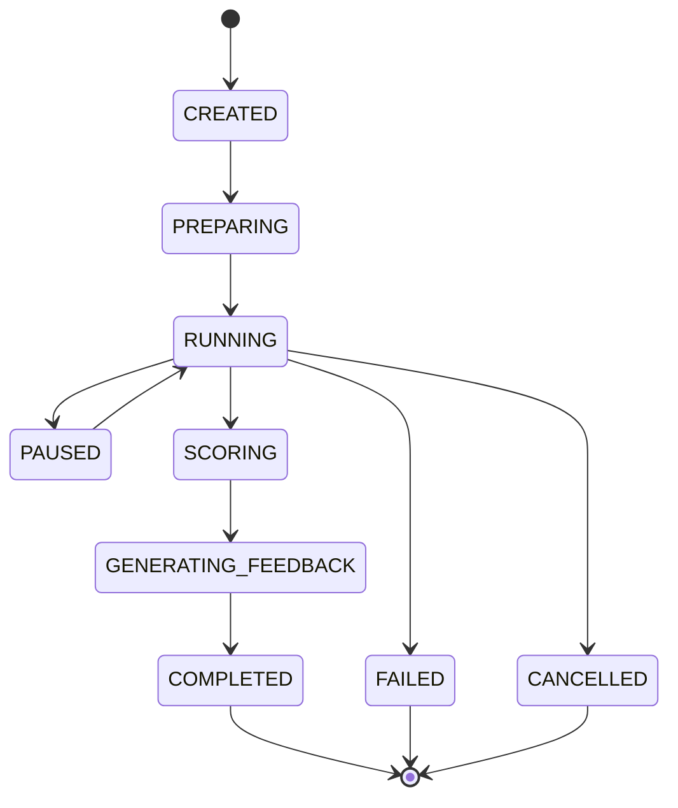
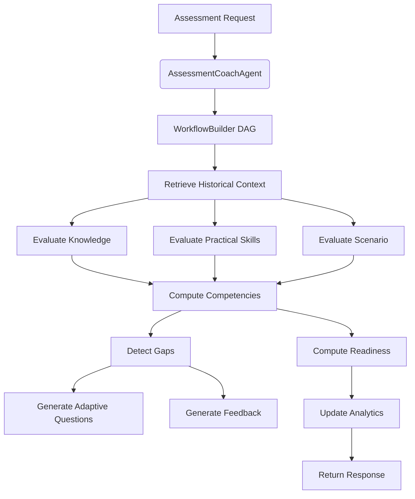

# Assessment Coach Architecture

## Overview

The Assessment Coach Agent relies on the standard platform `BaseAgent` and acts as a thin orchestrator over a suite of specialized tools. It implements v2.0 hardening principles including full lifecycle state management and append-only versioned memory.

## State Machine

## Parallel Execution DAG

## Tools
The agent uses 10 isolated tools representing distinct domains of evaluation, supporting dependency injection for future expansions. All outputs guarantee deterministic explainability.
