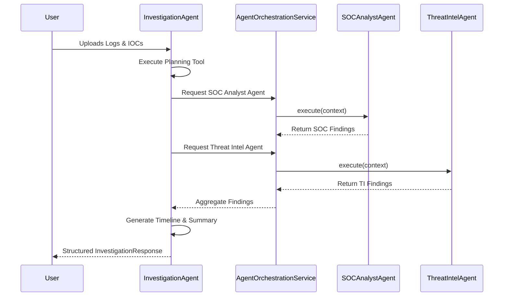

# Investigation Agent Collaboration

## Overview
The Investigation Agent achieves comprehensive incident response by orchestrating expert agents rather than performing specialized tasks itself. This document outlines the collaboration flow.

## Agent Orchestration Service
The `AgentOrchestrationService` is the critical bridge between the orchestrator and the experts. 
Located at `app/services/orchestration/`, it handles:
- **Resolution**: Locating the agent in the `AgentRegistry` / `AgentFactory`.
- **Invocation**: Passing context and executing the agent.
- **Aggregation**: Formatting the structured outputs into the investigation context.
- **Resilience**: Enforcing timeouts and retries, ensuring graceful degradation if an expert agent is unavailable.

## Collaboration Flow

1. **Evidence Ingestion**: The user submits evidence to the Investigation Agent.
2. **Planning Phase**: The `InvestigationPlanningTool` reviews the evidence types and outputs a structured plan specifying the required expert agents.
3. **Execution Phase**:
   - If log analysis is required, the Agent invokes the **SOC Analyst Agent**.
   - If IOC enrichment is required, the Agent invokes the **Threat Intelligence Agent**.
4. **Correlation**: The outputs from the expert agents are fed back into the Investigation Agent's context. The `EvidenceCorrelationTool` and `IncidentTimelineTool` synthesize this data.
5. **Synthesis**: The Investigation Agent summarizes the findings via the LLM, maintaining its pedagogical persona.

