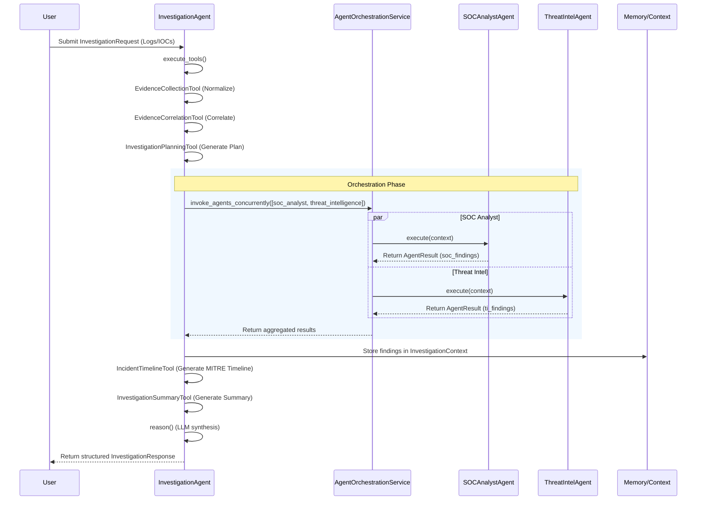

# Investigation Agent Sequence Diagram

This diagram illustrates how the Investigation Agent orchestrates expert agents using the `AgentOrchestrationService`.

```mermaid
sequenceDiagram
    participant U as User
    participant IA as InvestigationAgent
    participant AOS as AgentOrchestrationService
    participant SA as SOCAnalystAgent
    participant TI as ThreatIntelAgent
    participant M as Memory/Context

    U->>IA: Submit InvestigationRequest (Logs/IOCs)
    IA->>IA: execute_tools()
    IA->>IA: EvidenceCollectionTool (Normalize)
    IA->>IA: EvidenceCorrelationTool (Correlate)
    IA->>IA: InvestigationPlanningTool (Generate Plan)
    
    rect rgb(240, 248, 255)
    Note over IA,TI: Orchestration Phase
    IA->>AOS: invoke_agents_concurrently([soc_analyst, threat_intelligence])
    
    par SOC Analyst
        AOS->>SA: execute(context)
        SA-->>AOS: Return AgentResult (soc_findings)
    and Threat Intel
        AOS->>TI: execute(context)
        TI-->>AOS: Return AgentResult (ti_findings)
    end
    
    AOS-->>IA: Return aggregated results
    end
    
    IA->>M: Store findings in InvestigationContext
    IA->>IA: IncidentTimelineTool (Generate MITRE Timeline)
    IA->>IA: InvestigationSummaryTool (Generate Summary)
    IA->>IA: reason() (LLM synthesis)
    IA-->>U: Return structured InvestigationResponse
```
