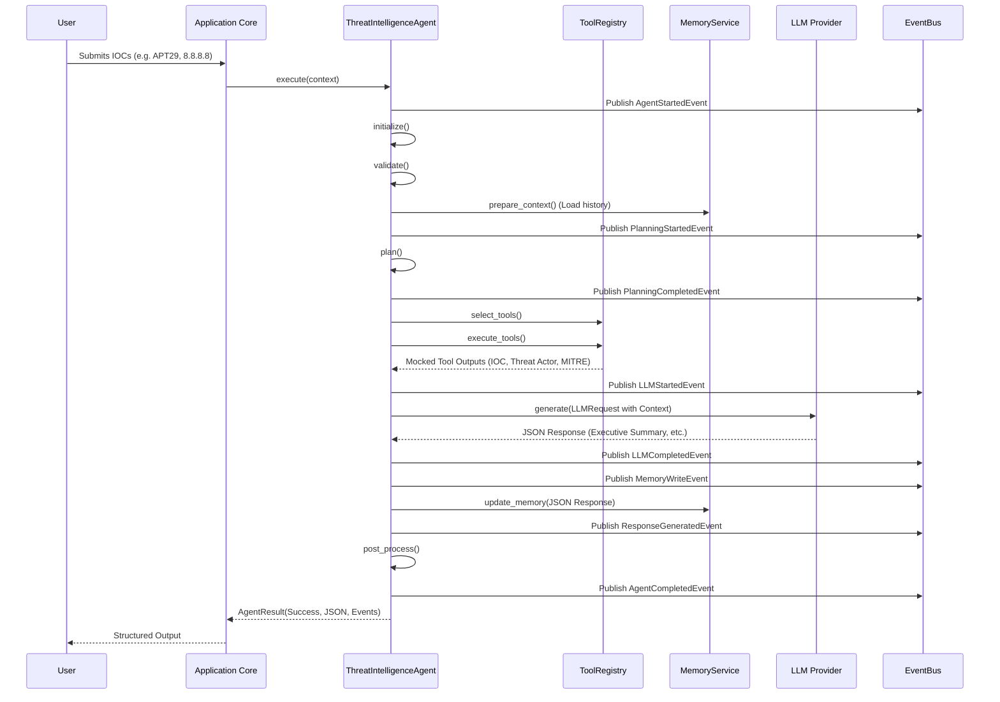

# Threat Intelligence Agent Sequence Diagram

```mermaid
sequenceDiagram
    participant User
    participant App as Application Core
    participant Agent as ThreatIntelligenceAgent
    participant Tools as ToolRegistry
    participant Memory as MemoryService
    participant LLM as LLM Provider
    participant Event as EventBus

    User->>App: Submits IOCs (e.g. APT29, 8.8.8.8)
    App->>Agent: execute(context)
    
    Agent->>Event: Publish AgentStartedEvent
    Agent->>Agent: initialize()
    Agent->>Agent: validate()
    
    Agent->>Memory: prepare_context() (Load history)
    
    Agent->>Event: Publish PlanningStartedEvent
    Agent->>Agent: plan()
    Agent->>Event: Publish PlanningCompletedEvent
    
    Agent->>Tools: select_tools()
    Agent->>Tools: execute_tools()
    Tools-->>Agent: Mocked Tool Outputs (IOC, Threat Actor, MITRE)
    
    Agent->>Event: Publish LLMStartedEvent
    Agent->>LLM: generate(LLMRequest with Context)
    LLM-->>Agent: JSON Response (Executive Summary, etc.)
    Agent->>Event: Publish LLMCompletedEvent
    
    Agent->>Event: Publish MemoryWriteEvent
    Agent->>Memory: update_memory(JSON Response)
    
    Agent->>Event: Publish ResponseGeneratedEvent
    Agent->>Agent: post_process()
    
    Agent->>Event: Publish AgentCompletedEvent
    Agent-->>App: AgentResult(Success, JSON, Events)
    App-->>User: Structured Output
```
