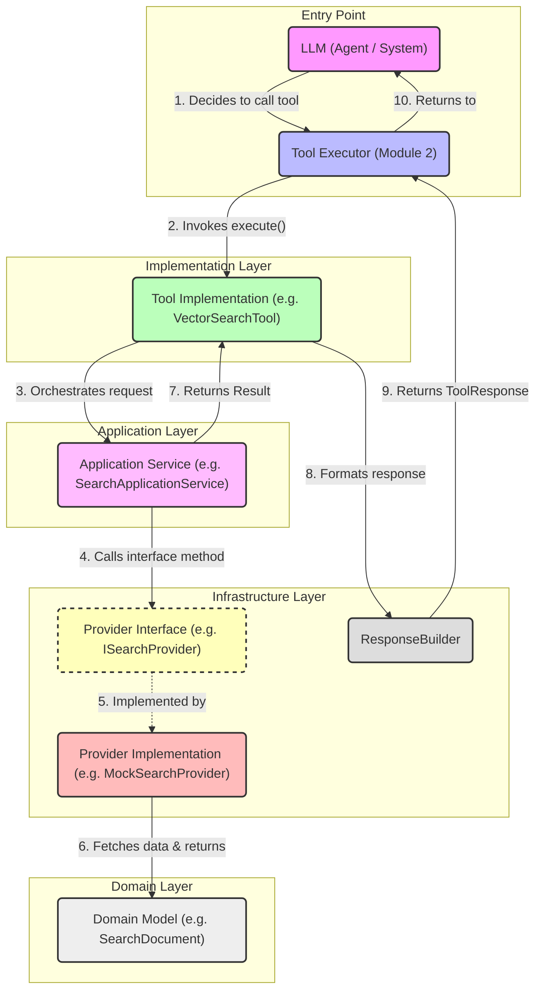

# Enterprise Tool Library Architecture

This diagram illustrates the high-level architecture of the Tool Execution flow, demonstrating the Clean Architecture layers and dependency inversion principles.

