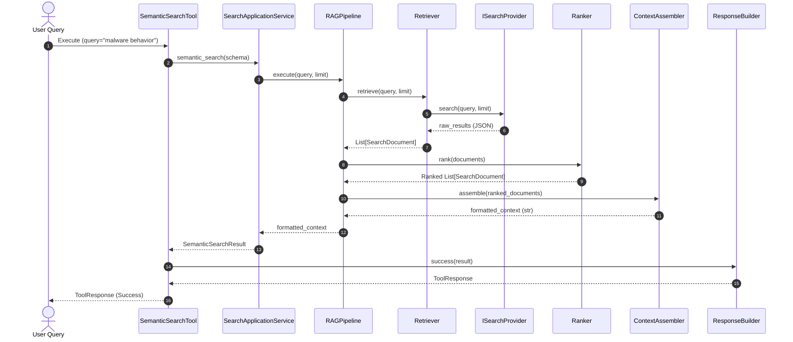

# Search Flow Sequence Diagram

This sequence diagram documents the exact end-to-end execution flow of a semantic search request, utilizing the RAG orchestration pipeline.

```mermaid
sequenceDiagram
    autonumber
    actor User as User Query
    participant Tool as SemanticSearchTool
    participant AppService as SearchApplicationService
    participant RAG as RAGPipeline
    participant Retriever as Retriever
    participant Provider as ISearchProvider
    participant Ranker as Ranker
    participant Assembler as ContextAssembler
    participant Builder as ResponseBuilder

    User->>Tool: Execute (query="malware behavior")
    Tool->>AppService: semantic_search(schema)
    AppService->>RAG: execute(query, limit)
    
    RAG->>Retriever: retrieve(query, limit)
    Retriever->>Provider: search(query, limit)
    Provider-->>Retriever: raw_results (JSON)
    Retriever-->>RAG: List[SearchDocument]
    
    RAG->>Ranker: rank(documents)
    Ranker-->>RAG: Ranked List[SearchDocument]
    
    RAG->>Assembler: assemble(ranked_documents)
    Assembler-->>RAG: formatted_context (str)
    
    RAG-->>AppService: formatted_context
    AppService-->>Tool: SemanticSearchResult
    
    Tool->>Builder: success(result)
    Builder-->>Tool: ToolResponse
    Tool-->>User: ToolResponse (Success)
```
