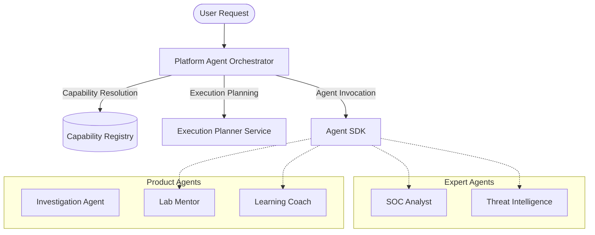
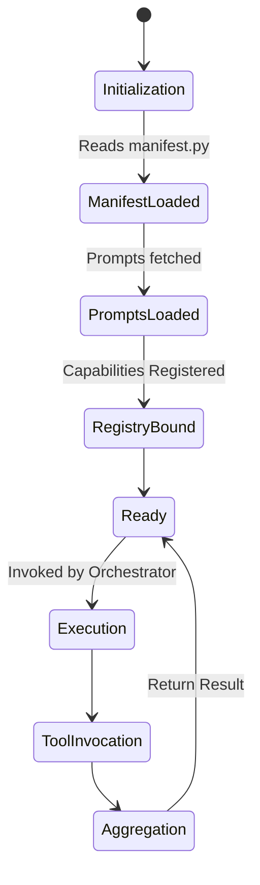
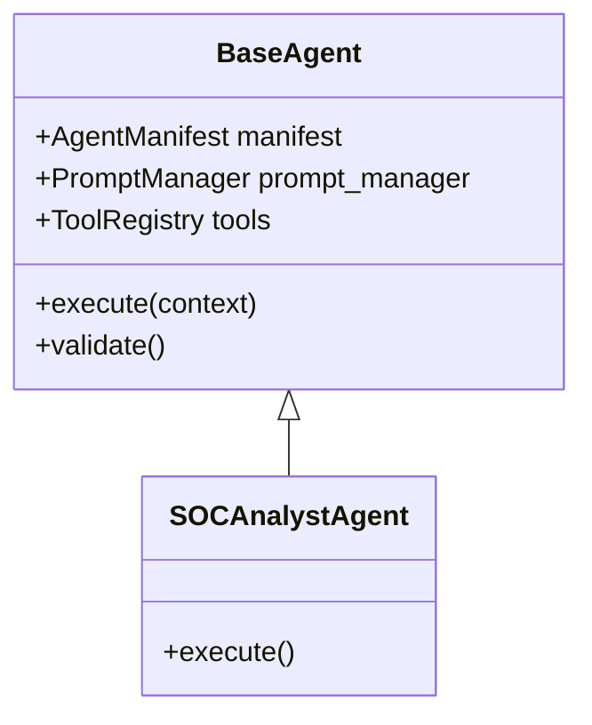
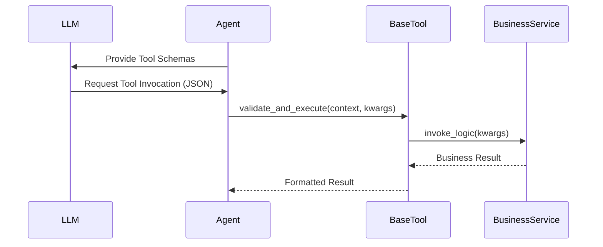
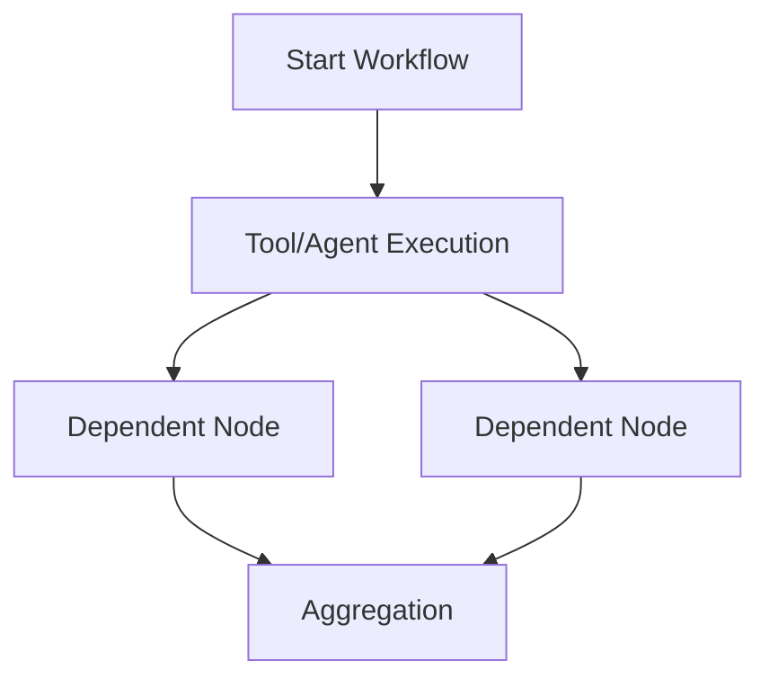
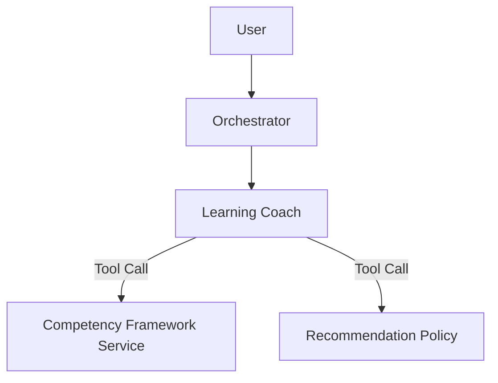
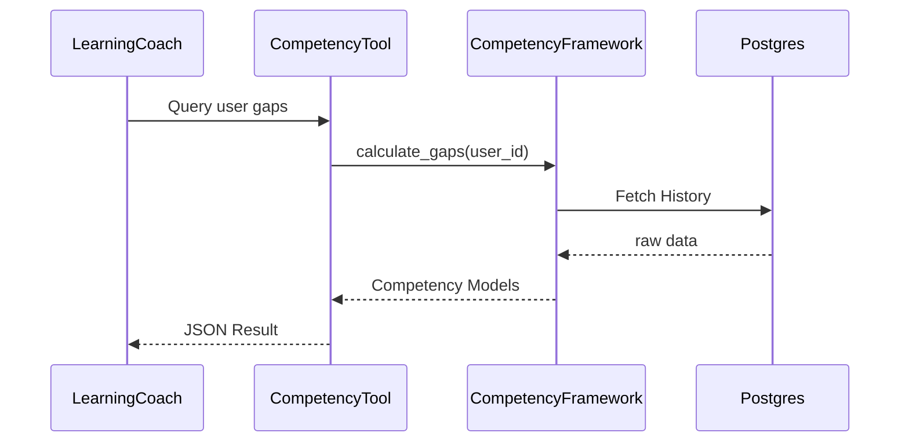
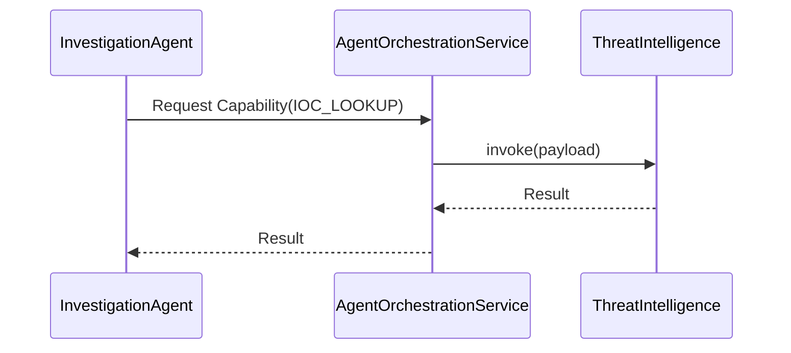
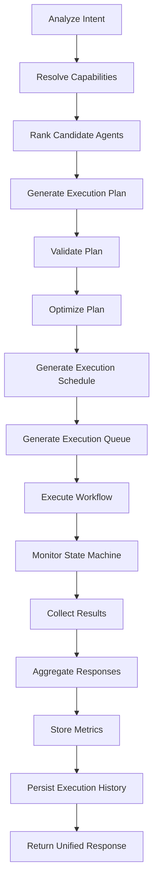
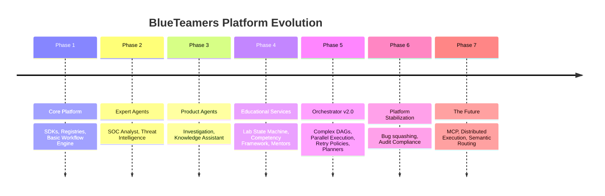

# BlueTeamers AI Assistant - Architecture & Technical Documentation

This document represents the complete architecture, implementation, design, workflow, and developer documentation for the BlueTeamers AI Assistant project, up to and including the Platform Agent Orchestrator v2.0 milestone.

---

## 01. Project Overview

### What is BlueTeamers AI Assistant?
BlueTeamers AI Assistant is an advanced, multi-agent cyber defense and educational platform. Designed as a modular, logic-free orchestration ecosystem, it weaves together expert threat intelligence and interactive educational mentoring into a single coherent conversational experience.

### Project Vision
To provide a world-class, autonomous platform that empowers both seasoned security operations center (SOC) analysts responding to active threats, and learners who are training in simulated lab environments, through highly specialized, cooperative AI agents.

### Goals
1. **Decoupled Architecture**: Maintain a strict separation of concerns where business logic is encapsulated in tools and shared services, and the orchestration layer remains thin.
2. **Enterprise Observability**: Native tracking of execution latencies, capability resolution metrics, and state-machine transitions across the entire platform.
3. **Extensibility**: Design a platform capable of handling future semantic embedding-based routing, autonomous workflows, and distributed multi-node execution.

### High-Level Architecture
The platform is built on an inversion-of-control paradigm, where agents do not directly invoke each other. Instead, they expose `Capabilities` which are resolved dynamically by the `Platform Agent Orchestrator`.



### Platform Philosophy & Core Principles
- **Thin Orchestrator**: The orchestrator must NEVER contain domain logic. It merely plans, schedules, routes, and aggregates.
- **SOLID Design**: High cohesion, low coupling. Agents do not import other agents.
- **Dependency Inversion**: Interactions occur over defined SDK protocols and the `AgentOrchestrationService`.
- **Stateless Execution**: Workflows rely on the `ExecutionStateMachine` and an abstract `ExecutionHistoryRepository` for recovery, allowing stateless parallel waves.

### Technology Stack
- **Language**: Python 3.10+
- **Frameworks**: FastAPI, Pydantic, asyncio
- **Testing**: Pytest (Unit & Integration)
- **Tooling**: Mermaid (Documentation), LangChain (underlying abstractions where applicable)

### Folder Structure Overview
- `app/agents/`: Domain-specific agents (e.g., `soc_analyst`, `lab_mentor`).
- `app/platform/`: Core infrastructure including the orchestrator (`platform_agent_orchestrator`).
- `app/services/`: Shared business and educational logic (e.g., `lab/`, `learning/`).
- `app/tools/`: The unified Tool SDK defining `BaseTool` and `ToolContext`.
- `app/observability/`: Tracing, metrics, and latency aggregation models.
- `docs/`: Comprehensive project documentation.

---

## 02. Building Agents

### Overview
Agents are the specialized "workers" of the BlueTeamers AI Assistant platform. They encapsulate strict domain boundaries (e.g., Threat Intelligence, Lab Mentoring) and respond to capability requests routed by the orchestrator.

### What is an Agent?
An Agent in this platform is NOT a monolith. It is a configuration of Prompts, Tools, and Workflows bound together by the `AgentManifest`. Following the "Thin Agent Philosophy", agents contain no complex business logic. Instead, they act as intelligent routers that utilize standard Python services via the Tool SDK.

### Agent Lifecycle


### Agent Anatomy
Every agent strictly adheres to a standard folder structure:
- `manifest.py`: Defines name, version, and the `Capabilities` this agent fulfills.
- `prompts.py`: Defines the system and tool prompts managed by the `PromptManager`.
- `tools/`: A directory of classes extending `BaseTool`.
- `agent.py`: The `BaseAgent` implementation mapping the manifest and tools together.

### Thin Agent Philosophy
Business logic is notoriously difficult to test when coupled with an LLM. Therefore, agents themselves only construct LLM calls. If an agent needs to evaluate a lab attempt, it uses a `EvaluateLabAttemptTool`, which in turn delegates to a stateless `LabAttemptService`. This makes the logic 100% unit-testable without mocking LLMs.

### Prompt Framework & Tool Integration
Agents use the `PromptManager` to hot-load templates based on the current context. Tools are dynamically injected into the LLM context through the `Tool SDK` schema generation.

### Capability Registration
Agents declare their capabilities in `manifest.py`. At startup, the platform scans all manifests and populates the `CapabilityRegistry`. When a user requests an investigation, the orchestrator queries the registry for `INVESTIGATION`, matching it to the `InvestigationAgent`.

---

## 03. Agent SDK

### Overview
The Agent SDK provides the foundational building blocks for creating agents in the BlueTeamers AI Assistant platform. It abstracts away boilerplate LLM integrations, capability registrations, and workflow plumbing, allowing developers to focus purely on configuring behavior and prompts.

### Architecture & BaseAgent
Every agent inherits from `BaseAgent`. The SDK strictly enforces the following implementations:
- `manifest`: An instance of `AgentManifest`.
- `tools`: A dictionary mapping tool names to initialized `BaseTool` instances.
- `prompts`: Configuration via `PromptManager`.



### AgentConfig & AgentManifest
- **AgentConfig**: Manages environment-specific configurations (e.g., API keys, timeout limits, retry boundaries).
- **AgentManifest**: A declarative payload (`name`, `version`, `description`, `capabilities`) used by the platform to discover the agent at runtime.

### CapabilityRegistry Integration
During application startup, the platform scans all agent modules. It extracts the `AgentManifest` and registers the capabilities against the agent ID in the `CapabilityRegistry`. The SDK handles this implicitly; the developer only defines the manifest.

### Runtime & Dependency Injection
The Agent SDK natively supports dependency injection via `ToolContext`. When an agent executes, it does not instantiate services. The Orchestrator injects the `ToolContext` (containing database sessions, active workflows, and auth boundaries) directly into the agent, which passes it down to the tools.

---

## 04. Tool SDK

### Overview
The Tool SDK enforces how agents interact with the underlying system. Under the "Thin Agent Philosophy", agents do not contain business logic; instead, they construct inputs for tools. The Tool SDK handles schema generation, execution wrapping, and failure catching.

### Tool Architecture
Every tool inherits from `BaseTool`.
- `name`: Must be unique and descriptive.
- `metadata`: A `ToolMetadata` object defining the expected `input_schema`, `output_schema`, and domain `tags`.
- `execute()`: The async method where the logic occurs.



### Tool Lifecycle & Execution
1. **Registration**: Tools are bound to agents in `agent.py`.
2. **Schema Generation**: `BaseTool` automatically translates its `ToolMetadata` into a schema digestible by the Prompt Framework/LLM.
3. **Execution**: The orchestrator triggers the agent, which triggers the tool passing down the `ToolContext`.
4. **Validation**: The tool validates inputs against Pydantic models before hitting the underlying service.

### Why Business Logic Belongs Here
If an agent contains the logic to query a database, that logic is impossible to reuse and hard to test. By moving logic into a standalone `Service` and wrapping it with a `Tool`, we achieve:
- **Testability**: Services can be unit-tested without LLMs.
- **Reusability**: Both the `SOCAnalystAgent` and the `InvestigationAgent` can use the exact same `NetworkTraceTool`.
- **Safety**: Tools enforce strict type boundaries before hitting critical systems.

---

## 05. Workflow Engine

### Overview
The Workflow Engine is the execution backbone of the platform. It translates declarative plans into executing graphs.

### WorkflowBuilder & DAG Execution
The `WorkflowBuilder` constructs a Directed Acyclic Graph (DAG) based on the execution plan provided by the orchestrator. It guarantees linear consistency and prevents circular dependencies.



### Scheduling & Parallel Execution
The orchestrator generates an `ExecutionSchedule`, dividing the DAG into `ExecutionWaves`.
Nodes that share no dependencies are scheduled in the same wave and executed in true parallel using Python's `asyncio.gather()`.

### Dependencies & Future Scalability
The `WorkflowEngine` is entirely decoupled from the business logic. It simply executes nodes based on metadata constraints. This prepares the platform for:
- Distributed Execution: Nodes can eventually be pushed to a message queue (e.g., Kafka) and picked up by worker nodes on different servers.
- Autonomous Workflows: The engine can loop back on itself safely if a "Re-evaluate" policy is injected.

---

## 06. Capability Registry

### Overview
The `CapabilityRegistry` acts as the global service mesh directory for the platform. Agents do not invoke each other by name; they request a capability. The registry maps capabilities to candidate agents.

### Registration & Lookup
When the platform boots, the `AgentOrchestrationService` traverses the `/agents` directory, extracting the `manifest.py` from each agent. 
```python
# Example mapping
registry = {
    "IOC_LOOKUP": ["ThreatIntelligenceAgent", "InvestigationAgent"],
    "LAB_MENTORING": ["LabMentorAgent"]
}
```

### Resolution & Ranking
For v2.0, capability resolution strictly uses:
1. **Exact Match**: Request for `IOC_LOOKUP` strictly matches agents declaring `IOC_LOOKUP`.
2. **Metadata Match**: Uses tags (e.g., `network`, `threat`) to find related fallback capabilities.

Because multiple agents can fulfill a capability, the registry returns a list of `CandidateAgent`s to the orchestrator, which then ranks them using the `AgentHealth` model (considering latency and load).

### Architecture Decisions & Future Semantic Matching
We explicitly avoided using vector embeddings for capability matching in the MVP.
- **Why?** Embeddings introduce non-determinism and require infrastructure (Vector DBs). 
- **Future?** The `CapabilityMatcher` interface was introduced so an `EmbeddingCapabilityMatcher` can easily be injected in v2.2 when the capability space grows too large for exact text matching.

---

## 07. Prompt Framework

### Overview
The `PromptManager` is a centralized utility that standardizes how LLM prompts are loaded, versioned, and composed across the entire platform. It decouples prompt strings from agent business logic.

### Prompt Templates & Loading
Prompts are defined in `prompts.py` within each agent's domain, but they are loaded dynamically via the `PromptManager`. 
```python
system_prompt = prompt_manager.load("soc_analyst", "system_prompt_v1")
```
This enables hot-swapping prompts via an external database without redeploying code.

### Composition & Best Practices
Prompts are composed dynamically by injecting standard system context (e.g., date, user profile, active workflow ID) appended automatically by the `OrchestratorContext`.
- **System Prompts**: Define the persona and constraints.
- **Task Prompts**: Define the current state of execution.
- **Tool Prompts**: Auto-generated by the `Tool SDK` schemas.

### Best Practices
- Keep Prompts thin: Do not embed business rules inside the prompt (e.g., "if lab score is > 80, say X"). Instead, move that rule to a Python `Service` that outputs a boolean, and simply pass that boolean into the prompt variables.

---

## 08. Expert Agents

### Overview
Expert Agents are highly specialized entities in the BlueTeamers AI Assistant platform. They represent the "backend specialists" of the platform and are rarely invoked directly by the user.

### Architecture
Expert Agents strictly inherit from `BaseAgent` and declare singular, deep capabilities.

### SOC Analyst Agent
- **Responsibilities**: Analyzing logs, correlating alerts, and identifying attack chains.
- **Capabilities**: `LOG_ANALYSIS`, `ALERT_CORRELATION`, `ATTACK_CHAIN_RECONSTRUCTION`.
- **Workflows**: Typically invoked by the `InvestigationAgent` to crunch raw data into actionable insights.

### Threat Intelligence Agent
- **Responsibilities**: Providing context on IP addresses, file hashes, and threat actors.
- **Capabilities**: `IOC_LOOKUP`, `THREAT_ACTOR_PROFILE`, `MITRE_MAPPING`.
- **Tools**: Integrates via the Tool SDK with external threat feeds (e.g., VirusTotal, MISP).

### Limitations & Future Enhancements
- **Limitations**: Expert agents have no context regarding the educational state of the user. They assume they are talking to a peer system.
- **Future Enhancements**: Allow Expert agents to stream large data processing updates back to the orchestrator via WebSockets.

---

## 09. Product Agents

### Overview
Product Agents represent the "frontend specialists." They maintain context about the user's intent, tone, and goals, and they weave the outputs of Expert Agents into a cohesive user experience.

### The Agents
1. **Investigation Agent**: Coordinates active incident response. It aggregates Threat Intelligence and SOC Analyst data to provide a comprehensive incident report.
2. **Knowledge Assistant**: General QA and platform navigation. Answers questions based on the documentation corpus.
3. **Lab Mentor**: Provides real-time guidance during interactive lab sessions. It uses the `Lab State Machine` to track progress.
4. **Assessment Coach**: Generates quizzes and evaluates user readiness for specific cybersecurity certifications.
5. **Learning Coach**: Generates long-term study plans and analyzes user knowledge gaps using the `Competency Framework`.

### Architecture & Dependencies
Product Agents heavily depend on Shared Educational Services. 
For example, the `LearningCoach` does NOT own the learner's history. It requests it via the `AttemptHistoryService`. It uses `RecommendationPolicy` to rank study materials. 


This ensures that the logic inside `LearningCoach` is purely conversational and interpretative.

---

## 10. Sharing Services

### Overview
Sharing Services are where the actual business logic of the BlueTeamers AI Assistant platform lives. By centralizing logic into standalone Python classes, we ensure it is unit-testable, versionable, and reusable across multiple agents.

### Core Educational Services

#### Reflection Engine
Analyzes a user's conversational history to extract implicit insights about their learning style and cognitive load. Used by both the `LabMentor` and `LearningCoach`.

#### Recommendation Policy
A strict rules engine that ranks study recommendations based on prerequisites, competency gaps, and available study time.

#### Competency Framework
Replaced generic skill-gap analysis. Tracks current level, target level, and confidence for specific domains (e.g., Incident Response, Cloud Security, Threat Hunting).

#### Lab State Machine
Manages the rigorous transitions of a user's lab attempt: `INITIALIZING -> RUNNING -> EVALUATING -> COMPLETED`. The `LabMentor` simply queries this state machine; it does not control it.

### Interaction Diagram


---

## 11. Agent Collaboration

### Overview
Agents in this platform are designed to be isolated nodes that collaborate exclusively through the `AgentOrchestrationService`. This document explains the routing logic before the introduction of the v2.0 Platform Agent Orchestrator.

### Execution Lifecycle
Historically (v1.x), an agent could request a capability from the `AgentOrchestrationService`. The service would query the `CapabilityRegistry` and immediately synchronously invoke the target agent, waiting for a response before continuing.



### Future Orchestration (v2.0)
While v1.x worked for simple graphs, it caused blocked threads and timeout cascades. The `Platform Agent Orchestrator (v2.0)` shifts this from an imperative `invoke()` model to a declarative DAG model. Now, Product Agents declare their capability dependencies upfront to the Orchestrator, which schedules them in parallel waves.

---

## 12. Platform Agent Orchestrator

### Overview
The Platform Agent Orchestrator (PAO) v2.0 is the definitive intelligent entry point into the BlueTeamers AI Assistant platform. It coordinates all agents while remaining a strictly thin orchestration layer devoid of domain-specific business logic.

### Architecture & Design Philosophy
The orchestrator leverages the `WorkflowBuilder` DAG and is governed by strict policies:
- **Thin Orchestrator**: The PAO never analyzes logs, grades labs, or makes business decisions. It delegates to the `AgentOrchestrationService` and `CapabilityRegistry`.
- **Abstract State Persistence**: Context and state tracking are decoupled via Repositories (`InMemoryExecutionHistoryRepository`, etc.).

### Execution Flow
The orchestrator DAG strictly follows this 16-step flow:


### Components
1. **Planner & Validator**: The `ExecutionPlannerService` creates sequential and parallel node structures. The `PlanValidatorService` verifies DAG integrity, preventing circular dependencies or unresolved targets.
2. **Optimizer**: The `ExecutionOptimizerService` structurally refines the plan (e.g., merging duplicate invocations) before scheduling.
3. **Scheduler & Queue**: Plans are sliced into an `ExecutionSchedule` of `ExecutionWaves`, converting nodes into an `ExecutionQueue` of `ExecutionBatch` objects. This natively supports distributed parallel execution.
4. **Execution State Machine**: Nodes transition safely from `PENDING -> READY -> RUNNING -> WAITING -> RETRYING -> COMPLETED`.
5. **Capability Ranking**: Uses the `AgentHealth` model to score candidate agents dynamically based on latency, load, and availability.

### Policies & Aggregation
- **Retry & Failure Recovery**: Handled by the `FailureClassifier` mapping errors to the `RetryPolicy` (defining exponential backoffs and limits).
- **Aggregation Policy**: Dictates how multiple agent responses are combined (e.g., `MERGE`, `PRIORITIZE`, `CONSENSUS`).

---

## 13. Observability

### Overview
Observability is a first-class citizen in the platform, ensuring zero-blind-spot visibility into agent collaboration, workflow DAG execution, and LLM latency.

### Tracing and Metrics
Every step in the Platform Agent Orchestrator binds latency measurements into `ExecutionMetadata`.
- **Workflow Metrics**: Tracks workflow depth, success rates, planning latency, and queue wait times.
- **Agent Metrics**: Agent health tracking updates availability and latency per target.

### Telemetry Strategy
Future updates will bind these metadata payloads to the `OpenTelemetry` standard for integration into enterprise dashboards like Grafana or Datadog.

---

## 14. Testing Strategy

### Overview
A rigorous, multi-tiered testing strategy guarantees that logic-free orchestrators and logic-heavy services are verified safely and independently.

### Strategy Breakdown
- **Unit Tests**: Mock the `AgentOrchestrationService`, `WorkflowEngine`, and `CapabilityRegistry`. Example: validating that `PlanValidatorService` throws errors on unresolvable target agents.
- **Integration Tests**: Use a real `WorkflowBuilder` with a fake registry. Validates full DAG traversal, state machine transitions, and capability fallback matching.
- **E2E Tests (Future)**: Spin up all real agents using localized models to validate complete LLM interaction loops and semantic routing.

---

## 15. Architecture Decisions

### Overview
Every architecture decision was optimized for modularity and scalability.

### Key Decisions & Tradeoffs
- **Why thin agents?**: Putting logic into LLM prompts makes it untestable and non-reusable. Shifting logic to Services makes the platform deterministic and robust.
- **Why shared services?**: If `LabMentor` and `AssessmentCoach` both need to know if a user understands "Phishing", extracting that logic to the `Competency Framework` prevents code duplication.
- **Why metadata matching over embeddings?**: In v2.0, exact and metadata matching is deterministic and faster. Embeddings introduce complexity (Vector DBs) and were deferred to v2.2 to keep the MVP lightweight.
- **Why the Policy Layer?**: Separating Retries, Aggregation, and Routing into policies allows the orchestrator to behave completely differently based on context without changing the core workflow code.

---

## 16. Project Roadmap

### Overview
The evolution of the BlueTeamers AI Assistant platform.



### The Future
1. **Distributed Execution**: Leveraging `ExecutionQueue` to run agents across multiple worker nodes (Kubernetes).
2. **Semantic Routing**: Moving from metadata capability resolution to full embedding-based intent routing.
3. **MCP Integration**: Expanding tools to use the Model Context Protocol for cross-platform integration.
4. **Autonomous Workflows**: Self-healing workflows that detect anomalies, generate remediation plans, and deploy fixes automatically.
